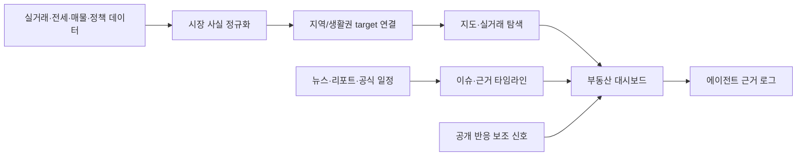
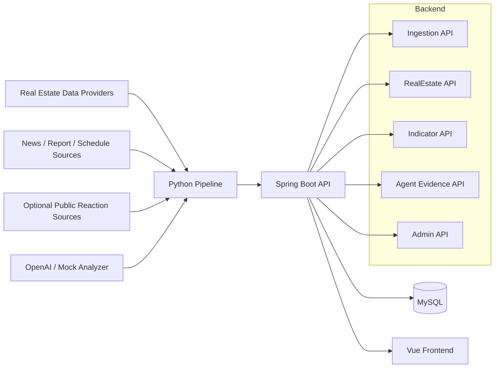

# 너나사 부동산 YouBuyFirst RealEstate

실거래, 전세, 매물, 공급, 정책 이슈를 지역 기준으로 연결해 
공식 데이터와 근거로 읽는 AI 부동산 인사이트 서비스

> 이 서비스는 지역과 생활권의 실거래·전세·매물·공급·정책 흐름을 뉴스/리포트 근거와 함께 보여주는 관찰형 인사이트 서비스입니다. 특정 매수, 매도, 청약, 대출 행동을 권유하지 않습니다.

## Overview

부동산 시장은 실거래가 한 줄이나 매물 숫자만으로 설명되지 않습니다. 거래 공개 지연, 전세 흐름, 공급 일정, 정책 발표, 교통·정비사업 이슈가 지역별로 다른 속도로 쌓입니다.

너나사 부동산은 흩어진 공식 데이터와 근거 링크를 지역/생활권 기준으로 묶고, 사용자가 실제 거래 흐름과 다음 확인 일정을 탐색할 수 있게 만드는 프로젝트입니다. 공개 커뮤니티 반응은 필요할 때만 보조 관찰 근거로 사용합니다.

## What Makes It Different

| 차별점 | 내용 |
| --- | --- |
| 실거래 기반 탐색 | 지역, 기간, 거래 유형, 가격대, 면적 조건으로 공식 거래 데이터를 탐색합니다. |
| 쪼개진 target graph | 한정된 단일 목록이 아니라 지역, 생활권, 정책 영향권, 검증된 단지 후보를 연결해 봅니다. |
| 시장 사실 연결 | 실거래, 전세, 매물, 정책, 공급, 교통 이벤트를 provider/asOf/stale와 함께 보여줍니다. |
| 주요 일정 | 가격지수, 실거래 공개, 미분양·공급, 금리, 청약, 정책 발표 일정을 한곳에서 확인합니다. |
| 근거 로그 | AI는 결론만 만들지 않고 어떤 공식 데이터, 링크, 시장 사실을 봤는지 사용자용 근거를 남깁니다. |

## Core Experience

| 경험 | 설명 |
| --- | --- |
| 지도 기반 지역 흐름 | 전국과 시군구 흐름을 가격지수와 시장 사실 기준으로 확인합니다. |
| 실거래 탐색 | 매매·전월세 거래를 지역, 기간, 면적, 가격 조건으로 필터링합니다. |
| 지역/단지 상세 | 실거래/전세/매물, 정책 이벤트, 뉴스/리포트 근거를 시간순으로 봅니다. |
| 주요 일정 | 공식 통계와 정책·청약·금리 발표를 월간 캘린더로 확인합니다. |
| 에이전트 근거 로그 | 지역 평가가 어떤 데이터 상태와 근거를 봤는지 추적합니다. |

## Product Flow

## Current Focus

| 영역 | 현재 정렬 방향 |
| --- | --- |
| RealEstate Domain | 지역, 생활권, 검증된 단지 후보, market fact, 정책 이벤트 모델 정리 |
| Market Data Pipeline | 실거래, 전세, 매물, 가격지수, 공급·정책 데이터의 provider/asOf/stale 정리 |
| Content & Schedule | 뉴스·리포트 근거 링크와 공식 발표 일정 관리 |
| Agent Layer | 지역 인사이트와 근거 로그, 데이터 한계 설명 |
| Frontend | 대시보드, 지도, 실거래 탐색, 주요 일정, 상세 리포트 UI |

## Architecture

## Tech Stack

| Layer | Stack |
| --- | --- |
| Backend | Java 21, Spring Boot 3.3, Spring Web, JPA, Bean Validation, Flyway |
| Database | MySQL 8.4, H2 for tests |
| Pipeline | Python 3.10+, APScheduler, HTTPX, BeautifulSoup, Playwright fallback |
| AI | OpenAI adapter, mock analyzer |
| Frontend | Vue 3, Vite, TypeScript, Vue Router, Vitest |
| Infra | Docker Compose, Swagger UI |

## Backend & Data Focus

이 프로젝트는 공식 부동산 시장 사실 데이터와 이슈 근거를 같은 대상 키로 묶는 백엔드 문제를 다룹니다.

| 주제 | 보여주려는 역량 |
| --- | --- |
| 데이터 파이프라인 | provider 수집, 정규화, 분석, 저장까지 이어지는 비동기 데이터 흐름 설계 |
| 도메인 모델링 | 지역, 생활권, 검증 단지, market fact, 일정, 근거 로그의 기준 식별자 정리 |
| API 설계 | 화면용 API, 내부 수집 API, 운영 확인 API의 책임 분리 |
| 데이터 신뢰도 | provider, asOf, stale, 공식 데이터 없음, 공개 지연을 명확히 표시 |
| AI 기능 통제 | AI가 행동 지시를 하지 않고 근거 요약과 비교 관찰을 돕는 구조 |
| 개발 기록 | 문제 해결, 품질 개선, 기술 의사결정을 재사용 가능한 경험으로 기록 |

## Active Docs

- 핵심 구현 범위: `docs/product/CORE_IMPLEMENTATION_SCOPE.md`
- 한페이지 기획안: `docs/product/real-estate-one-page-plan.html`
- 제품 방향: `docs/product/REAL_ESTATE_PRODUCT_DIRECTION.md`
- 작업 지도: `docs/current/TASKS.md`
- 현재 인수인계: `docs/current/HANDOFF.md`
- 부동산 도메인: `docs/domains/realestate/README.md`
- 작업 영역: `docs/layers/ops/WORK_AREAS.md`
- UI 기준: `docs/layers/ui/WIREFRAME_HANDOFF.md`
