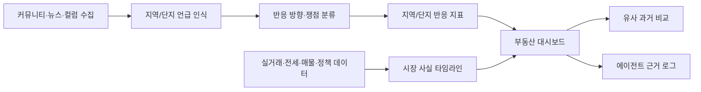
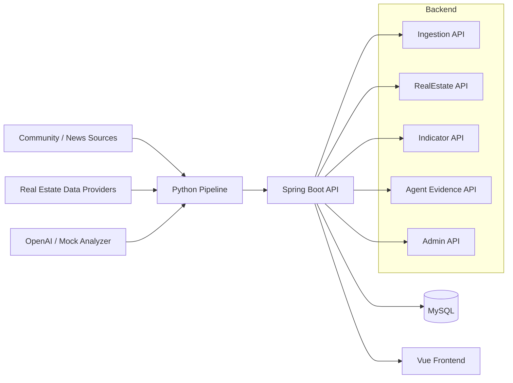

# 너나사 부동산 YouBuyFirst RealEstate

커뮤니티 반응, 뉴스/컬럼 이슈, 실거래/전세/매물 데이터를 연결해 
사람들의 말과 데이터로 읽는 AI 부동산 인사이트 서비스

> 이 서비스는 지역과 단지에 대한 실제 사람들의 반응, 뉴스/컬럼 이슈, 시장 사실 데이터를 함께 보여주는 관찰형 분석 서비스입니다. 특정 매수, 매도, 청약, 대출 행동을 권유하지 않습니다.

## Overview

부동산 시장은 실거래가와 매물 숫자만으로 설명되지 않습니다. 정책, 교통, 학군, 전세, 공급, 재건축 같은 이슈가 커뮤니티와 뉴스에서 먼저 퍼지고, 사람들의 기대와 우려가 지역과 단지별 분위기를 만듭니다.

너나사 부동산은 흩어진 글과 링크를 지역/단지 기준으로 묶고, 언급량, 기대/우려, 쟁점 비율, 표본 신뢰도, 시장 사실 타임라인을 한 화면에서 읽게 만드는 프로젝트입니다.

## What Makes It Different

| 차별점 | 내용 |
| --- | --- |
| 지역/단지 중심 반응 분석 | 커뮤니티 글, 댓글, 뉴스, 컬럼에서 지역과 단지 언급을 찾아 반응 지표로 정리합니다. |
| 쪼개진 target graph | 한정된 단일 목록이 아니라 지역, 단지, 생활권, 정책 영향권을 연결해 봅니다. |
| 시장 사실 연결 | 실거래, 전세, 매물, 정책, 공급, 교통 이벤트를 provider/asOf/stale와 함께 보여줍니다. |
| 유사 과거 비교 | 비슷한 반응과 쟁점이 있었던 과거 상황과 이후 시장 흐름을 연결합니다. |
| 근거 로그 | AI는 결론만 만들지 않고 어떤 글, 링크, 시장 사실을 봤는지 사용자용 근거를 남깁니다. |

## Core Experience

| 경험 | 설명 |
| --- | --- |
| 요즘 언급 많은 지역/단지 | 최근 언급량이 늘어난 지역과 단지를 랭킹과 지표로 확인합니다. |
| 지역/단지 상세 | 반응 지표, 주요 쟁점, 뉴스/컬럼, 실거래/전세/매물, 정책 이벤트를 시간순으로 봅니다. |
| 쟁점 비율 | 교통, 학군, 전세, 재건축, 청약, 대출, 공급, 정책 같은 말거리의 비중을 봅니다. |
| 유사 과거 상황 | 비슷한 반응 패턴 이후 가격, 전세, 매물 흐름이 어땠는지 비교합니다. |
| 에이전트 근거 로그 | 지역/단지 평가가 어떤 데이터 상태와 근거를 봤는지 추적합니다. |

## Product Flow

## Current Focus

| 영역 | 현재 정렬 방향 |
| --- | --- |
| RealEstate Domain | 지역, 단지, 생활권, 정책 영향권, alias, market fact, 정책 이벤트 모델 정리 |
| Community Pipeline | 공개 수집, source policy, 제한 원문 저장, 지역/단지 mention 입력 |
| Reaction Indicator | 지역/단지별 언급량, 기대/우려, 쟁점 비율, 표본 신뢰도 |
| Agent Layer | 지역/단지 평가와 근거 로그, 유사 과거 비교 설명 |
| Frontend | 실제 대시보드형 화면, 지역/단지 상세, 타임라인과 지표 UI |

## Architecture

## Tech Stack

| Layer | Stack |
| --- | --- |
| Backend | Java 21, Spring Boot 3.3, Spring Web, JPA, Bean Validation, Flyway |
| Database | MySQL 8.4, H2 for tests |
| Pipeline | Python 3.10+, APScheduler, HTTPX, BeautifulSoup, Playwright fallback |
| AI | OpenAI adapter, mock analyzer |
| Frontend | Vue 3, Vite, TypeScript, Vue Router, Vitest |
| Infra | Docker Compose, Swagger UI |

## Backend & Data Focus

이 프로젝트는 커뮤니티 비정형 데이터와 부동산 시장 사실 데이터를 같은 대상 키로 묶는 백엔드 문제를 다룹니다.

| 주제 | 보여주려는 역량 |
| --- | --- |
| 데이터 파이프라인 | 수집, 정제, 분석, 저장까지 이어지는 비동기 데이터 흐름 설계 |
| 도메인 모델링 | 지역, 단지, 별칭, market fact, 반응 지표의 기준 식별자 정리 |
| API 설계 | 화면용 API, 내부 수집 API, 운영 확인 API의 책임 분리 |
| 데이터 신뢰도 | provider, asOf, stale, 표본 부족, 소스 편중을 명확히 표시 |
| AI 기능 통제 | AI가 행동 지시를 하지 않고 근거 요약과 비교 관찰을 돕는 구조 |
| 개발 기록 | 문제 해결, 품질 개선, 기술 의사결정을 재사용 가능한 경험으로 기록 |

## Active Docs

- 핵심 구현 범위: `docs/product/CORE_IMPLEMENTATION_SCOPE.md`
- 한페이지 기획안: `docs/product/real-estate-one-page-plan.html`
- 제품 방향: `docs/product/REAL_ESTATE_PRODUCT_DIRECTION.md`
- 작업 지도: `docs/current/TASKS.md`
- 현재 인수인계: `docs/current/HANDOFF.md`
- 부동산 도메인: `docs/domains/realestate/README.md`
- 작업 영역: `docs/layers/ops/WORK_AREAS.md`
- UI 기준: `docs/layers/ui/WIREFRAME_HANDOFF.md`
