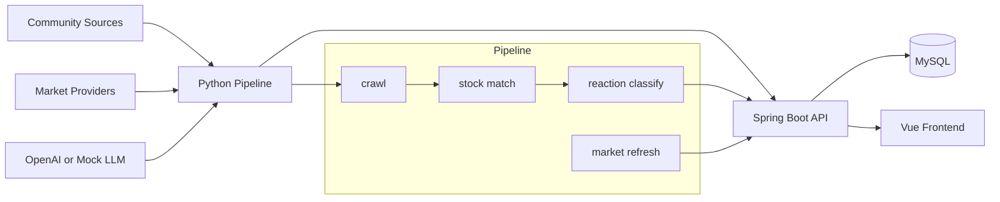

# 너나사 YouBuyFirst

커뮤니티 반응, 시장 데이터, AI 분석, 모의투자를 결합해 개인 투자자가 "지금 사람들이 어떤 종목에 왜 반응하는지"를 빠르게 확인하는 투자 참고형 시뮬레이터입니다.

> 실제 투자 자문, 실거래 지시, 수익 보장, 개인화 투자 권유를 제공하지 않습니다. 모든 화면과 데이터는 투자 판단의 참고와 모의 실험을 위한 관찰 정보로 다룹니다.

## Why

일반 금융 서비스는 가격, 차트, 뉴스는 잘 보여주지만 커뮤니티에서 어떤 종목이 갑자기 언급되는지, 그 반응이 낙관인지 공포인지, 이후 가격 흐름과 어떤 관계가 있었는지는 한 화면에서 보기 어렵습니다.

너나사는 커뮤니티 반응을 수집하고 종목별로 정리한 뒤, 시세와 뉴스 흐름, AI 요약, 모의투자 결과를 연결합니다. 목표는 "사라/팔아라"가 아니라 "왜 지금 이 종목이 뜨는지, 그 근거가 얼마나 믿을 만한지"를 확인하게 만드는 것입니다.

## Product Loop

1. 관심종목에서 가격, 거래량, 커뮤니티 반응, 뉴스/공시 변화가 감지됩니다.
2. 종목 상세에서 변화 원인, 근거 링크, 신뢰도/주의 배지를 확인합니다.
3. 개미 심리 지수와 커뮤니티별 반응 흐름으로 시장 분위기를 봅니다.
4. 모의 포트폴리오와 AI 에이전트 판단 로그로 이후 결과를 복기합니다.

## Features

| 영역 | 설명 | 현재 상태 |
| --- | --- | --- |
| 커뮤니티 수집 | 네이버 종토방, 에펨코리아 등 커뮤니티 글 수집과 source policy 관리 | 진행 중 |
| 종목 인식 | 국내/미국 종목, ETF, 별칭, 티커 후보를 같은 종목 key로 연결 | 진행 중 |
| 커뮤니티 반응 | 글 단위 반응 방향과 30분 단위 종목별 metric 집계 | 기반 구현 |
| 개미 심리 지수 | 언급량, 반응 방향, 확산, 신뢰도를 묶은 대표 지표 | 설계 중 |
| 시장 데이터 | yfinance, FinanceDataReader 기반 quote, chart candle, 국내 수급 snapshot | 진행 중 |
| 종목 상세 | 가격, 차트, 수급, 커뮤니티 반응, 이벤트 타임라인, 팩트폭격 배너 | mock + 일부 API 연동 |
| 모의투자 | 가상 예수금, 주문, 체결, 원장, 포지션, 수익률 | 설계 예정 |
| AI 에이전트 | 전략별 paper trading 판단, decision key, 판단 로그 | 설계 예정 |

## Architecture

## Tech Stack

| Layer | Stack |
| --- | --- |
| Backend | Java 21, Spring Boot 3.3, Spring Web, JPA, Bean Validation, Flyway |
| Database | MySQL 8.4, H2 for tests |
| Pipeline | Python 3.10+, APScheduler, HTTPX, BeautifulSoup, Playwright fallback, OpenAI adapter |
| Market data | yfinance, FinanceDataReader, pykrx 보조 후보 |
| Frontend | Vue 3, Vite, TypeScript, Vue Router, Vitest, Lightweight Charts |
| Infra | Docker Compose, Swagger UI |

## Implementation Highlights

- 커뮤니티 수집은 소스별 정책을 먼저 확인하는 fail-closed 구조로 설계했습니다.
- 가격, 차트, 수급 데이터는 provider, 지연, `asOf`, stale 상태를 분리해 화면에 표시합니다.
- 종목 상세 화면은 차트만 보여주는 페이지가 아니라 가격, 커뮤니티 반응, 수급, 뉴스/링크, 신뢰도 배지를 함께 읽는 화면으로 구성했습니다.
- AI/LLM은 종목 언급 검증과 반응 분류를 보조하되, 투자 행동을 직접 지시하는 문구를 만들지 않도록 제품 정책을 분리했습니다.
- 문서와 Notion 기록은 단순 작업 로그가 아니라 문제 해결, 품질 개선, 기술 의사결정을 취업 포트폴리오 소재로 남기는 방향으로 관리합니다.

## Portfolio Focus

이 프로젝트는 단순 화면 구현보다 다음 경험을 보여주는 것을 목표로 합니다.

- 커뮤니티 데이터 수집 정책과 공개 배포 리스크 관리
- provider별 시세 데이터 지연, stale, 실패 상태 처리
- 종목 master, alias, provider symbol을 잇는 데이터 모델링
- 모의투자 원장과 트랜잭션 정합성 설계
- AI 판단 결과를 서비스 문구와 분리해 안전하게 표현하는 설계
- 문제 해결, 성능 개선, 품질 개선, 기술 의사결정의 기록화
