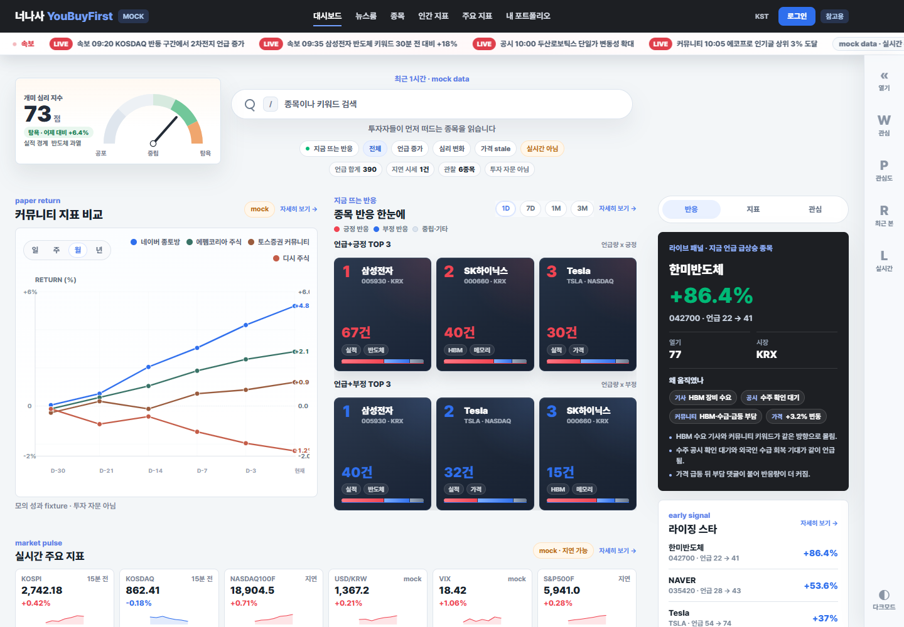
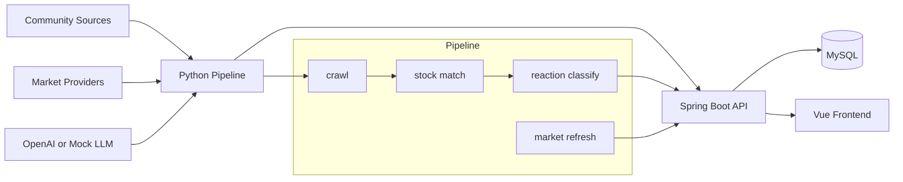

# 너나사 YouBuyFirst


커뮤니티 반응, 시장 데이터, AI 분석, 모의투자를 결합해 개인 투자자가 "지금 사람들이 어떤 종목에 왜 반응하는지"를 빠르게 확인하는 투자 참고형 시뮬레이터입니다.

> 실제 투자 자문, 실거래 지시, 수익 보장, 개인화 투자 권유를 제공하지 않습니다. 모든 화면과 데이터는 투자 판단의 참고와 모의 실험을 위한 관찰 정보로 다룹니다.



## Why

일반 금융 서비스는 가격, 차트, 뉴스는 잘 보여주지만 커뮤니티에서 어떤 종목이 갑자기 언급되는지, 그 반응이 낙관인지 공포인지, 이후 가격 흐름과 어떤 관계가 있었는지는 한 화면에서 보기 어렵습니다.

너나사는 커뮤니티 반응을 수집하고 종목별로 정리한 뒤, 시세와 뉴스 흐름, AI 요약, 모의투자 결과를 연결합니다. 목표는 "사라/팔아라"가 아니라 "왜 지금 이 종목이 뜨는지, 그 근거가 얼마나 믿을 만한지"를 확인하게 만드는 것입니다.

## Product Loop

1. 관심종목에서 가격, 거래량, 커뮤니티 반응, 뉴스/공시 변화가 감지됩니다.
2. 종목 상세에서 변화 원인, 근거 링크, 신뢰도/주의 배지를 확인합니다.
3. 개미 심리 지수와 커뮤니티별 반응 흐름으로 시장 분위기를 봅니다.
4. 모의 포트폴리오와 AI 에이전트 판단 로그로 이후 결과를 복기합니다.

## Features

| 영역 | 설명 | 현재 상태 |
| --- | --- | --- |
| 커뮤니티 수집 | 네이버 종토방, 에펨코리아 등 커뮤니티 글 수집과 source policy 관리 | 진행 중 |
| 종목 인식 | 국내/미국 종목, ETF, 별칭, 티커 후보를 같은 종목 key로 연결 | 진행 중 |
| 커뮤니티 반응 | 글 단위 반응 방향과 30분 단위 종목별 metric 집계 | 기반 구현 |
| 개미 심리 지수 | 언급량, 반응 방향, 확산, 신뢰도를 묶은 대표 지표 | 설계 중 |
| 시장 데이터 | yfinance, FinanceDataReader 기반 quote, chart candle, 국내 수급 snapshot | 진행 중 |
| 종목 상세 | 가격, 차트, 수급, 커뮤니티 반응, 이벤트 타임라인, 팩트폭격 배너 | mock + 일부 API 연동 |
| 모의투자 | 가상 예수금, 주문, 체결, 원장, 포지션, 수익률 | 설계 예정 |
| AI 에이전트 | 전략별 paper trading 판단, decision key, 판단 로그 | 설계 예정 |

## Architecture



## Tech Stack

| Layer | Stack |
| --- | --- |
| Backend | Java 21, Spring Boot 3.3, Spring Web, JPA, Bean Validation, Flyway |
| Database | MySQL 8.4, H2 for tests |
| Pipeline | Python 3.10+, APScheduler, HTTPX, BeautifulSoup, Playwright fallback, OpenAI adapter |
| Market data | yfinance, FinanceDataReader, pykrx 보조 후보 |
| Frontend | Vue 3, Vite, TypeScript, Vue Router, Vitest, Lightweight Charts |
| Infra | Docker Compose, Swagger UI |

## Repository Structure

```text
backend/                Spring Boot API, ingestion, admin, market endpoints
pipeline/               crawler, analysis pipeline, market provider adapters
front/                  Vue 3 mock UI and API-facing screen shell
docs/product/           product plan and decision notes
docs/current/           current handoff and task map
docs/domains/           domain contracts: community, stock, indicator, market, simulation, agent
docs/layers/ui/         screen briefs, design system, visual history
docs/layers/ops/        workflow, PR, branch, Notion, documentation rules
docs/governance/        technical risks, legal risks, troubleshooting
```

## Quick Start

### 1. Run with Docker Compose

```bash
docker compose up --build
```

Backend:

```text
http://localhost:8080
http://localhost:8080/swagger-ui.html
```

MySQL is exposed on local port `3307`.

### 2. Run frontend locally

```bash
npm install --prefix front
npm run dev --prefix front
```

Default Vite URL:

```text
http://127.0.0.1:5173/dashboard
```

### 3. Optional LLM config

If `OPENAI_API_KEY` is not set, the pipeline uses a local mock provider for demos and tests.

```bash
OPENAI_API_KEY=...
OPENAI_MODEL=gpt-4.1-mini
```

### 4. Local crawler policy

External community collection is fail-closed by default. For local research runs:

```bash
CRAWL_RUNTIME_ENV=local
```

The project does not use CAPTCHA bypass, login-session crawling, proxy rotation, or fingerprint evasion.

## API Snapshot

| Endpoint | Purpose |
| --- | --- |
| `GET /api/quotes` | public quote snapshot with provider, delay, `asOf`, `stale`, `dataStatus` |
| `GET /api/market/chart-candles` | public stock-detail chart candles |
| `GET /api/market/investor-flows/history` | domestic investor-flow history |
| `GET /admin/crawl-runs` | crawl run inspection |
| `GET /admin/crawl-targets` | crawl target queue inspection |
| `GET /admin/posts` | collected post inspection |
| `GET /admin/stocks/{symbol}/metrics` | stock-level community metrics |
| `POST /internal/ingestions/community-posts` | pipeline ingestion for community posts |
| `POST /internal/ingestions/crawl-runs` | pipeline crawl run report |
| `POST /internal/crawl-targets/claim` | pipeline target claim |

## Test

```bash
npm run build --prefix front
npm test --prefix front
```

```bash
cd backend
mvn clean test
```

```bash
cd pipeline
pip install -e .[test]
pytest
```

## Development Roadmap

완성 순서는 독립 기능을 아무렇게나 나누는 방식이 아니라, 사용자가 실제로 매일 쓰는 흐름을 기준으로 세로 slice를 먼저 만듭니다.

1. **UI screen contract 정리**
   `dashboard`, `stocks`, `stock-detail`, `newsroom`, `human-indicator`, `portfolio` 순서로 화면별 필수 field와 API 후보를 고정합니다.

2. **Stock master 정리**
   국내 주식/ETF와 미국 주식/ETF를 같은 canonical key로 다루고, provider symbol, alias, 표시명, 시장 구분을 연결합니다.

3. **Market data 안정화**
   quote, chart candle, investor flow provider를 분리하고, 지연, `asOf`, stale, 빈 데이터, provider 실패 상태를 화면에 정확히 표시합니다.

4. **Community source registry 확장**
   에펨코리아, 네이버 종토방, 뽐뿌 증권포럼, 디시 미국주식/주식갤러리/국내주식 후보를 source status와 공개 가능 범위로 관리합니다.

5. **개미 심리 지수 v1**
   언급량 변화, 반응 방향, 표현 강도, 인기글 확산, 소스 다양성, 표본 신뢰도, 시세 지연을 하나의 관찰 지표로 묶습니다.

6. **Stock detail event timeline**
   뉴스, 공시, 리포트, 영상, 블로그, 커뮤니티, 가격 이벤트를 같은 시간축으로 묶어 종목 상세의 핵심 경험을 완성합니다.

7. **Simulation ledger**
   가상 예수금, 주문, 예약, 체결, 정산, 원장, 포지션, 손익 계산의 트랜잭션 경계를 설계합니다.

8. **Agent decision log**
   strategy version, input window, decision key, idempotency key를 두어 같은 통계 window에서 중복 판단과 중복 주문을 막습니다.

9. **Backend and pipeline integration**
   화면 계약을 실제 데이터로 채우기 위해 readiness wait, Swagger example, validation error response, fixture-to-real-data 전환 기준을 정리합니다.

10. **Expansion**
    OCR 자산 연동, 알림, Redis/WebSocket, 사용자 반응방, vector DB 기반 유사 상황 검색, 부동산 버티컬을 후순위로 검토합니다.

## Documentation

- Product plan: [docs/product/FINAL_PRODUCT_PLAN.md](docs/product/FINAL_PRODUCT_PLAN.md)
- Current task map: [docs/current/TASKS.md](docs/current/TASKS.md)
- UI screen briefs: [docs/layers/ui/screens](docs/layers/ui/screens)
- Market contracts: [docs/domains/market](docs/domains/market)
- Engineering evidence guide: [docs/layers/ops/ENGINEERING_EVIDENCE_GUIDE.md](docs/layers/ops/ENGINEERING_EVIDENCE_GUIDE.md)
- Risk register: [docs/governance/TECHNICAL_RISK_REGISTER.md](docs/governance/TECHNICAL_RISK_REGISTER.md)

## Portfolio Focus

이 프로젝트는 단순 화면 구현보다 다음 경험을 보여주는 것을 목표로 합니다.

- 커뮤니티 데이터 수집 정책과 공개 배포 리스크 관리
- provider별 시세 데이터 지연, stale, 실패 상태 처리
- 종목 master, alias, provider symbol을 잇는 데이터 모델링
- 모의투자 원장과 트랜잭션 정합성 설계
- AI 판단 결과를 서비스 문구와 분리해 안전하게 표현하는 설계
- 문제 해결, 성능 개선, 품질 개선, 기술 의사결정의 기록화
