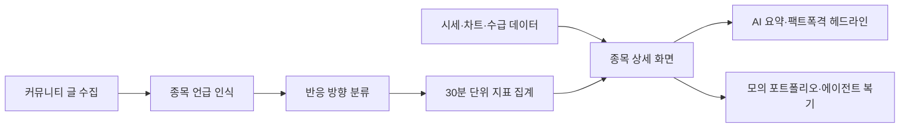
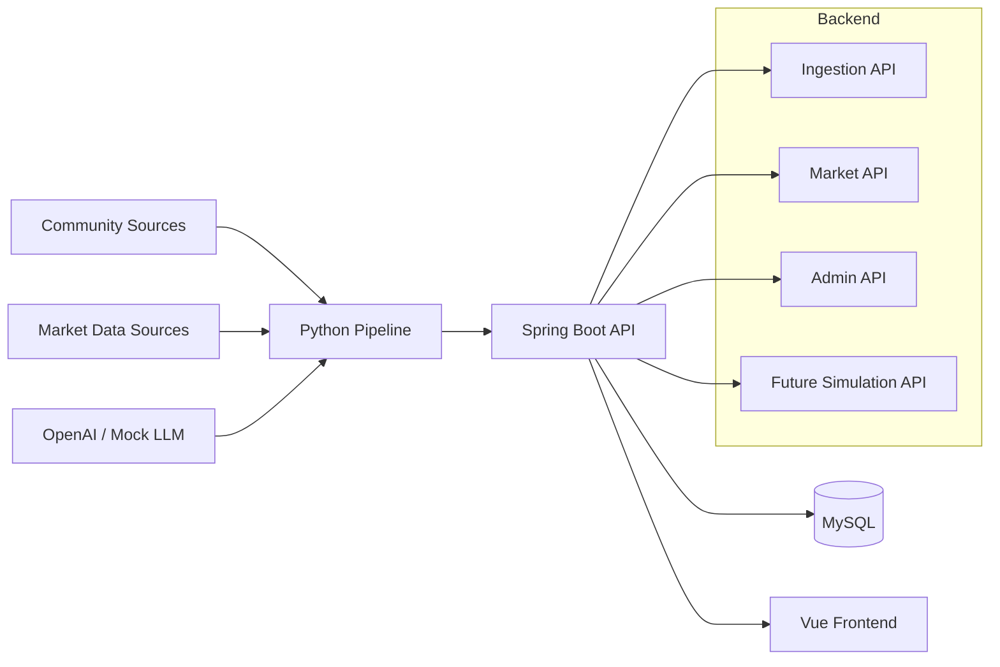

# 너나사 YouBuyFirst

커뮤니티 반응, 시장 데이터, AI 분석, 모의투자를 연결해 
"지금 사람들이 어떤 종목에 왜 반응하는지"를 읽는 투자 참고형 시뮬레이터

> 너나사는 실제 투자 자문, 실거래 지시, 수익 보장, 개인화 투자 권유를 제공하지 않습니다. 모든 분석은 투자 판단을 대신하는 신호가 아니라 커뮤니티와 시장 데이터를 함께 읽기 위한 관찰 정보입니다.

  

## Overview

주식 커뮤니티에서는 특정 종목의 언급량과 분위기가 빠르게 바뀝니다. 하지만 기존 금융 서비스는 차트, 뉴스, 종목 토론방이 흩어져 있어 "왜 지금 이 종목이 뜨는지"를 한 번에 보기 어렵습니다.

너나사는 커뮤니티 글을 수집하고 종목 언급과 반응 방향을 분석한 뒤, 시세와 뉴스 흐름, AI 요약, 모의투자 결과를 같은 화면 경험으로 연결합니다.

## What Makes It Different

너나사는 단순한 종목 게시판이나 차트 뷰어가 아닙니다. 가격 변동만 보여주는 대신, 커뮤니티에서 어떤 종목이 왜 언급되는지, 그 반응이 뉴스와 가격 흐름 속에서 어떤 의미를 갖는지 함께 보여주는 것을 목표로 합니다.

| 차별점 | 내용 |
| --- | --- |
| 커뮤니티 중심 분석 | 흩어진 주식 커뮤니티 글을 종목 단위로 묶어 언급량과 반응 방향을 관찰합니다. |
| 시장 데이터 연결 | 시세, 거래량, 차트, 수급 후보 데이터를 커뮤니티 반응과 같은 맥락에서 보여줍니다. |
| AI 요약의 역할 제한 | AI는 투자 결론을 대신 내리지 않고, 근거 요약과 비교 관찰을 돕는 보조 계층으로 둡니다. |
| 모의투자 복기 | 실제 매매가 아니라 가상 원장과 포지션을 통해 판단 과정과 결과를 되돌아봅니다. |

## Core Experience

| 경험 | 설명 |
| --- | --- |
| 관심종목 브리핑 | 내가 보는 종목의 가격, 거래량, 언급량, 뉴스 변화를 압축해서 보여줍니다. |
| 종목 상세 분석 | 차트, 수급, 커뮤니티 반응, 근거 링크, 이벤트 타임라인을 한 화면에서 확인합니다. |
| 개미 심리 지수 | 흩어진 커뮤니티 반응을 종목별 관찰 지표로 정리합니다. |
| 커뮤니티 성과 실험 | 커뮤니티별 반응이 이후 가격 흐름과 어떤 관계가 있었는지 모의 전략으로 비교합니다. |
| AI 에이전트 | 서로 다른 투자 페르소나가 같은 데이터를 보고 어떻게 판단했는지 기록합니다. |
| 모의 포트폴리오 | 실제 매매가 아니라 가상 주문, 체결, 원장, 손익을 통해 판단을 복기합니다. |

## Product Flow

## Current Features

| 영역 | 현재 구현/설계 |
| --- | --- |
| Community Pipeline | 커뮤니티 글 수집, source policy, crawl run 기록, 제한 원문 저장 |
| Stock Matching | 국내/미국 종목, ETF, 별칭, 티커 후보 매칭 |
| Reaction Analysis | 글 단위 종목 반응 방향 분류와 종목별 metric 저장 |
| Market Data | quote snapshot, chart candles, 국내 수급 snapshot API |
| Frontend | Vue 기반 대시보드, 종목 상세, 뉴스룸, 인간 지표, 포트폴리오 화면 |
| AI Layer | OpenAI 연동 계층, mock 분석기, 종목 언급 검증/반응 분석 |
| Simulation | 가상 주문, 체결, 원장, 포지션, 손익 계산 도메인 설계 중 |

## Architecture

## Tech Stack

| Layer | Stack |
| --- | --- |
| Backend | Java 21, Spring Boot 3.3, Spring Web, JPA, Bean Validation, Flyway |
| Database | MySQL 8.4, H2 for tests |
| Pipeline | Python 3.10+, APScheduler, HTTPX, BeautifulSoup, Playwright fallback |
| AI | OpenAI adapter, mock analyzer |
| Market Data | yfinance, FinanceDataReader, pykrx 보조 후보 |
| Frontend | Vue 3, Vite, TypeScript, Vue Router, Vitest, Lightweight Charts |
| Infra | Docker Compose, Swagger UI |

## Backend & Data Focus

이 프로젝트는 단순히 화면을 만드는 것이 아니라, 커뮤니티 데이터가 금융 도메인의 종목/시세/모의거래 흐름과 연결될 때 생기는 백엔드 문제를 다룹니다.

| 주제 | 보여주려는 역량 |
| --- | --- |
| 데이터 파이프라인 | 수집, 정제, 분석, 저장까지 이어지는 비동기 데이터 흐름 설계 |
| 도메인 모델링 | 종목, 별칭, 커뮤니티 지표, 시장 데이터의 기준 식별자 정리 |
| API 설계 | 프론트 화면에서 필요한 데이터를 public/internal/admin API로 분리 |
| 트랜잭션 설계 | 가상 주문, 체결, 원장, 포지션, 손익 계산의 정합성 관리 |
| AI 연동 | LLM을 투자 지시자가 아니라 분석 보조자로 제한하는 구조 |
| 품질 기록 | 문제 해결, 품질 개선, 기술 의사결정을 재사용 가능한 경험으로 기록 |

## Portfolio Focus

포트폴리오 관점에서는 "주식 화면을 만들었다"보다, 커뮤니티 비정형 데이터와 금융 도메인 데이터를 하나의 서비스 흐름으로 묶는 과정에 초점을 둡니다.

| 포커스 | 보여주는 역량 |
| --- | --- |
| 풀스택 제품 구현 | Spring Boot API, Python 수집/분석 파이프라인, Vue 화면을 하나의 사용자 경험으로 연결 |
| 데이터 정규화 | 커뮤니티 글, 종목 별칭, 티커, 시세 데이터를 같은 기준으로 매칭하는 설계 |
| 금융 도메인 정합성 | 주문, 체결, 원장, 포지션, 손익 계산처럼 틀어지면 안 되는 데이터 흐름 설계 |
| API 경계 설계 | 화면용 API, 내부 수집 API, 운영 확인 API의 책임 분리 |
| AI 기능 통제 | AI가 투자 지시를 하지 않도록 역할을 제한하고, 분석 근거를 화면에 남기는 설계 |
| 개발 기록 | 기술 의사결정, 트러블슈팅, 성능/품질 개선 과정을 포트폴리오 근거로 축적 |
