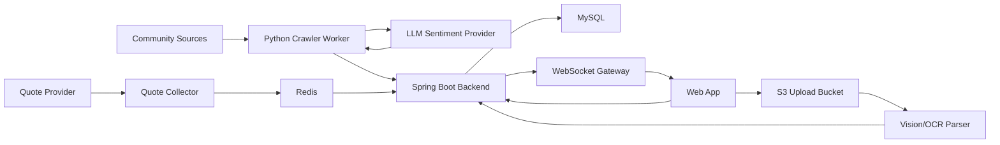

# 인간지표 최종 기획안

## 제품 한 줄 설명

인간지표는 커뮤니티 군중 심리, 실시간 시세, AI 추론을 결합해 "대중과 반대로 투자하라"는 가설을 모의투자로 검증하는 AI 퀀트 시뮬레이터입니다.

## 제품 목표

차트와 재무제표 중심의 투자 도구가 아니라, 사람들이 어디에 몰리고 무엇을 두려워하는지 수치화합니다. 사용자는 군중 심리 지표를 보고, AI 에이전트와 모의투자 경쟁을 하며, 자신의 투자 판단이 대중 심리와 어떤 관계에 있는지 학습합니다.

이 제품은 실제 투자 자문이나 자동 주문 서비스가 아니라 B2C 모의투자와 교육형 분석 서비스로 설계합니다. 운영 단계에서도 "실거래 지시", "수익 보장", "개인화 투자 권유"처럼 법적 위험이 큰 표현과 기능은 배제합니다.

## 핵심 사용자

- 커뮤니티 분위기와 투자 심리를 빠르게 보고 싶은 개인 투자자
- 투자 아이디어를 검증하고 싶은 초보 투자자
- AI 에이전트, 모의투자, 데이터 파이프라인을 포트폴리오로 보여주고 싶은 개발자
- 감성 데이터 기반 시장 지표에 관심 있는 퀀트/데이터 분석 학습자

## 최종 핵심 기능

### 1. 커뮤니티 감성 모멘텀

국내 주요 커뮤니티와 종목 토론방에서 신규 글을 수집합니다. 게시글에서 국내 주식, 미국 주식, ETF 언급을 인식하고, 종목별 감성을 `bullish`, `bearish`, `neutral`로 분류합니다.

최종 지표는 단순 긍정/부정 비율이 아니라 언급량, 감성 강도, 증가율, 신뢰도, 소스 가중치를 함께 반영합니다.

주요 화면:

- 종목별 언급량 순위
- 열기 지수 순위
- 1시간/24시간 급등 종목
- 소스별 감성 분포
- 과열, 공포, 무관심 구간 표시

### 2. AI 3줄 요약과 이슈 설명

열기 지수가 급증한 종목에 대해 AI가 "왜 지금 언급량이 터졌는지"를 짧게 설명합니다. 원문을 그대로 노출하지 않고, 집계된 맥락과 제한 저장된 snippet을 기반으로 요약합니다.

요약은 다음 정보를 포함합니다.

- 언급량 증가 원인
- 커뮤니티가 기대하거나 걱정하는 포인트
- 투자 판단이 아니라 관찰 가능한 심리 신호라는 고지

### 3. 실시간 모의투자

사용자와 AI 에이전트가 동일한 가상 예수금으로 모의투자를 진행합니다. 주문은 실제 증권사 주문이 아니라 내부 체결 엔진에서 가상 체결됩니다.

주요 기능:

- 가상 예수금
- 시장가/지정가 모의 주문
- 보유 종목, 평가 손익, 실현 손익
- 거래 내역과 체결 로그
- 동시 클릭, 다중 기기 요청에 대한 잔고 원자성 보장
- 수익률 리더보드

### 4. AI 에이전트 배틀

서로 다른 투자 페르소나를 가진 AI 에이전트가 같은 시장 데이터를 보고 매매 결정을 내립니다.

초기 에이전트 후보:

- 역발상 에이전트: 환희 구간에서 매도, 공포 구간에서 매수
- 모멘텀 에이전트: 언급량과 가격 추세가 동시에 상승할 때 추격
- 리스크 관리형 에이전트: 변동성과 손실 제한을 우선
- 관망형 에이전트: 확신이 낮으면 현금을 보유

에이전트는 내부 추론 전문을 노출하지 않고, 사용자에게 보여줄 짧은 결정 근거만 기록합니다.

### 5. 내 자산 OCR 연동

사용자가 타 증권사 앱의 잔고 화면을 캡처해 올리면, AI Vision이 종목명, 평단가, 보유수량을 추출해 가상 포트폴리오에 등록합니다.

최종 구조:

- 클라이언트가 S3 Presigned URL로 직접 업로드
- 서버는 업로드 권한과 분석 요청만 관리
- Vision API가 구조화 JSON을 생성
- 서버가 종목 마스터와 정합성을 검증한 뒤 저장
- 원본 이미지는 짧은 보관 기간 뒤 삭제

### 6. 실시간 시세와 호가

한국투자증권 OpenAPI 같은 외부 시세 API를 통해 실시간 가격을 받아 Redis에 캐싱합니다. WebSocket으로 사용자 화면에 가격 변화와 모의 체결 상태를 브로드캐스팅합니다.

최종 구조:

- 시세 collector
- Redis latest quote cache
- Spring WebSocket/STOMP gateway
- UI price ticker
- API 장애 시 stale quote 표시와 fallback

### 7. 알림과 자동화

후순위 기능으로 텔레그램 또는 앱 알림을 제공합니다. 알림은 투자 권유가 아니라 사용자가 설정한 조건 충족 안내로 제한합니다.

예시:

- 특정 종목 열기 지수 급등
- 공포/환희 구간 진입
- AI 에이전트 매매 발생
- 내 모의 포트폴리오 손익률 임계값 도달

## 최종 시스템 아키텍처

## 주요 데이터 도메인

- Instrument: 국내/미국 주식, ETF, 별칭
- CommunityPost: 제한 저장된 게시글 메타데이터와 snippet
- StockMention: 게시글 안에서 인식된 종목 언급
- SentimentAnalysis: 종목별 감성, confidence, 짧은 근거
- MetricSnapshot: 30분 단위 집계
- UserPortfolio: 사용자 가상 포트폴리오
- SimulatedOrder: 모의 주문
- SimulatedExecution: 가상 체결
- AgentDecision: AI 에이전트의 행동과 사용자용 근거
- QuoteSnapshot: 최신 시세와 호가

## 보수적 개발 로드맵

### Phase 0. 작업 관리와 배포 기반

- GitHub remote 연결
- 한 작업 단위당 한 PR 규칙 정착
- GitHub Actions CI
- Docker Compose smoke test
- 문서 기반 인수인계 체계 유지

### Phase 1. 데이터 파이프라인 MVP

- 네이버 종토방, 에펨코리아 수집
- 종목 마스터와 별칭 매칭
- LLM sentiment provider
- ingestion API와 admin API
- 30분 집계

### Phase 2. 감성 대시보드

- 사용자용 ranking API
- 열기 지수 산식 확정
- 종목별 추세 조회
- 간단한 웹 대시보드
- AI 3줄 요약

### Phase 3. 모의투자 엔진

- 가상 예수금과 포트폴리오
- 주문/체결 도메인
- 잔고 동시성 제어
- 거래 내역과 수익률 계산
- 리더보드

### Phase 4. AI 에이전트

- 에이전트 페르소나 정의
- 의사결정 입력 데이터 표준화
- 매매 결정 로그
- 에이전트별 성과 비교

### Phase 5. OCR 자산 연동

- S3 Presigned URL 업로드
- Vision parser
- 자산 등록 검증
- 이미지 보관/삭제 정책

### Phase 6. 실시간 시세와 운영 안정화

- 외부 시세 API 연동
- Redis quote cache
- WebSocket broadcast
- 장애 격리, retry, backoff
- 인증, rate limit, 모니터링

## 명시적 제외 및 주의 사항

- 실제 투자 자문, 실거래 자동 주문, 수익 보장 표현은 하지 않습니다.
- 커뮤니티 로그인, CAPTCHA 회피, 프록시 우회, 지문 위장은 하지 않습니다.
- 원문 대량 저장과 외부 원문 재배포는 하지 않습니다.
- 내부 chain-of-thought는 저장하거나 노출하지 않고, 사용자용 짧은 근거만 저장합니다.

## 병렬 작업으로 나누기 좋은 단위

- crawler adapter 안정화
- instrument master 확장
- sentiment provider와 schema 검증
- Spring ingestion idempotency와 bulk insert
- metrics API와 ranking API
- dashboard UI
- simulated trading engine
- OCR upload and parser
- quote collector and WebSocket
- security and operations
