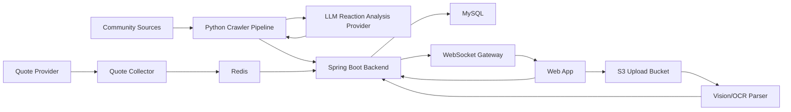

# 너나사 (YouBuyFirst) 최종 기획안

## 제품 한 줄 설명

너나사 (YouBuyFirst)는 커뮤니티 반응, 시장 시세, AI 분석, 모의투자를 결합해 "대중보다 먼저 사고, 대중과 반대로 검증한다"는 아이디어를 실험하는 투자 참고형 시뮬레이터입니다.

## 제품 목표

차트와 재무제표만 보여주는 도구가 아니라, 커뮤니티가 어떤 종목에 몰리고 어떤 이슈에 반응하는지 수치화합니다. 사용자는 종목별 커뮤니티 반응, 가격 변화, 커뮤니티별 성과 검증, AI 에이전트의 모의 판단을 함께 보면서 투자 아이디어를 점검합니다.

이 제품은 실제 투자 자문이나 자동 주문 서비스가 아니라 B2C 모의투자와 교육형 분석 서비스로 설계합니다. 운영 단계에서도 "실거래 지시", "수익 보장", "개인화 투자 권유"처럼 법적 위험이 큰 표현과 기능은 배제합니다.

## 핵심 사용자

- 커뮤니티 반응 흐름을 빠르게 보고 싶은 개인 투자자
- 가격, 거래량, 커뮤니티 반응을 한 화면에서 보고 싶은 개인 투자자
- 투자 아이디어를 검증하고 싶은 초보 투자자
- AI 에이전트, 모의투자, 데이터 파이프라인을 포트폴리오로 보여주고 싶은 개발자
- 커뮤니티 반응 기반 시장 지표에 관심 있는 퀀트/데이터 분석 학습자

## 일일 투자자 루프

사용자가 매일 제품을 여는 이유는 전체 랭킹보다 "내가 보는 종목에 오늘 무슨 변화가 생겼는가"입니다. 최종 제품은 아래 루프를 중심으로 화면과 데이터를 묶습니다.

1. 관심종목에서 가격, 거래량, 커뮤니티 반응, 기사/공시 변화가 감지됩니다.
2. 사용자는 왜 언급량이나 반응이 변했는지 원인 후보를 확인합니다.
3. 종목 상세에서 기사, 공시, 커뮤니티 키워드, 가격 변화를 하나의 시간순 타임라인으로 봅니다.
4. 신호 신뢰도와 주의 표시를 보고 표본 부족, 특정 커뮤니티 편중, 시세 지연, 루머 가능성을 구분합니다.
5. 모의 포트폴리오에서는 내가 판단한 시점과 이후 커뮤니티 반응/가격 흐름을 복기합니다.

## 제품 용어 기준

사용자 화면의 대표 용어는 `커뮤니티 반응`입니다. `감성`은 기분 분석처럼 들리고, `커뮤니티 반응 신호`는 번역체처럼 느껴질 수 있으므로 사용자-facing 기획과 화면에서는 쓰지 않습니다.

- 단일 글에서 특정 종목을 바라보는 방향은 `반응 방향`이라고 부릅니다.
- 여러 커뮤니티 글을 종목/기간 단위로 묶은 대표 점수는 `개미 심리 지수`라고 부릅니다. 0-100 점수로 표현하되 매수/매도 신호가 아니라 커뮤니티 반응의 낙관, 비관, 과열, 무관심 정도를 압축한 관찰 지표입니다.
- 문서와 기술 설명에서는 상위 개념을 `커뮤니티 반응 데이터`라고 부릅니다.
- 내부 후보 필드는 `reactionDirection`을 우선합니다. `stance`는 짧지만 직관성이 떨어지므로 쓰지 않습니다.
- 표시값은 `낙관`, `비관`, `중립`을 우선하고, 구현 enum은 기존 `bullish`, `bearish`, `neutral`과 매핑합니다.
- 구체적인 버튼, 카드, 차트 문구는 `front` 트랙에서 실제 화면 정보 구조가 나올 때 별도로 정합니다.
- 세부 기준은 `docs/COMMUNITY_REACTION_GUIDE.md`를 따릅니다.

## 최종 핵심 기능

### 1. 관심종목 브리핑과 이벤트 타임라인

투자자는 전체 시장보다 자신이 관찰하거나 보유한 종목의 변화를 먼저 확인합니다. 관심종목 브리핑은 사용자가 직접 등록한 종목, 모의 포트폴리오 보유 종목, 최근 자주 본 종목을 기준으로 오늘의 변화만 압축해 보여줍니다.

주요 화면:

- 관심종목별 가격, 거래량, 언급량, 반응 방향 변화
- 종목 상세 상단의 시황/기술지표/재무 기반 팩트폭격 헤드라인
- 새로 감지된 이슈와 반복 키워드
- 종목별 최신 기사/공시 리스트
- 종목별 증권 유튜브, 신뢰 블로그, 인기글/개념글 링크 묶음
- 기사, 공시, 커뮤니티 반응, 가격 변화를 합친 이벤트 타임라인
- 표본 수 부족, 특정 커뮤니티 편중, 시세 지연, 기사 없음 같은 신뢰도/주의 배지

기사와 공시는 원문 전문을 재게시하지 않고 제목, 출처, 시간, 링크, 관련 키워드 중심으로 보여줍니다. 종목 상세의 팩트폭격 헤드라인은 커뮤니티 반응 요약이 아니라 시황, 기술 지표, 재무, 뉴스/공시, 컨센서스 기반의 종목 상태 요약입니다. 화면 문구는 투자 판단을 유도하지 않고 "관찰된 변화"와 "확인할 이벤트"로 제한하되, 제품 톤은 `docs/STOCK_DETAIL_COPY_GUIDE.md`의 짠맛/팩트폭격 기준을 따릅니다.

블로그는 전체 검색 결과를 무제한으로 긁기보다 사전에 선정한 증권/투자 블로거 whitelist를 추적합니다. 커뮤니티는 일반 최신 글 수집으로 초기 언급 증가를 감지하고, 인기글/개념글/추천글/조회수 상위글은 실제 확산 여부를 확인하는 증폭 레이어로 둡니다. 유튜브, 블로그, 인기글 링크는 원문 대체 화면이 아니라 사용자가 이슈의 출처를 확인하는 외부 링크 카드로만 표시합니다.

### 2. 커뮤니티 반응 모멘텀

국내 주요 커뮤니티와 종목 토론방에서 신규 글을 30분 단위로 수집합니다. 게시글에서 국내 주식, 미국 주식, ETF 언급을 인식하고, 종목별 반응 방향을 `bullish`, `bearish`, `neutral`로 분류합니다.

최종 지표는 단순 낙관/비관 비율이 아니라 언급량, 반응 강도, 증가율, 신뢰도, 소스 가중치를 함께 반영합니다.

`개미 심리 지수`는 커뮤니티 반응 모멘텀의 대표 지표입니다. 종목별로 0-100 점수를 만들고, 구성 요소는 언급량 변화, 낙관/비관 반응 비율, 표현 강도, 인기글/개념글 확산, 소스 다양성, 표본 수 신뢰도, 시세 지연 상태를 함께 봅니다. 70 이상은 과열/낙관 우세, 30 이하는 공포/비관 우세, 45-55는 방향성 약함으로 표시하되, 실제 화면에서는 점수와 함께 표본 수와 신뢰도 배지를 항상 붙입니다.

임베딩/클러스터링은 MVP의 첫 단계가 아니라 커뮤니티 반응 데이터가 쌓인 뒤 붙이는 확장 기능입니다. 기본 흐름은 수집, 종목 인식, 반응 방향 분류, 30분 집계가 먼저이고, 이후 임베딩으로 의미가 비슷한 글을 묶어 토픽을 만들거나 과거의 유사 반응 상황을 찾습니다. 이 기능은 "종목을 찾는 정본"이 아니라 "왜 이런 분위기가 생겼는지 설명하고 과거와 비교하는 분석 레이어"로 사용합니다.

주요 화면:

- 종목별 언급량 순위
- 열기 지수 순위
- 개미 심리 지수 순위와 급변 종목
- 종목별 주요 반응 토픽과 대표 근거 글
- 과거 유사 커뮤니티 반응 상황과 이후 가격/언급량 변화
- 1시간/24시간 급등 종목
- 소스별 반응 방향 분포
- 과열, 공포, 무관심 구간 표시
- 소스 내부 기준 상위 인기글/개념글과 관련 종목 연결

### 3. 시장 시세와 호가

투자 참고 사이트로서 커뮤니티 반응 지표만으로는 부족하므로, 종목별 가격, 등락률, 거래량, 호가 또는 지연 시세를 반응 지표와 함께 보여줍니다. MVP 기본 데이터 조합은 `yfinance` + FinanceDataReader입니다. `yfinance`는 국내/미국 시세와 거래량, FinanceDataReader는 국내 종목 메타데이터와 일봉/스냅샷 보강, 국내 수급 후보를 담당합니다. 공개 화면은 차트 전체를 외부 위젯으로 처리하되, 종목 카드와 상세 화면에는 provider 기준 지연 quote snapshot을 제한적으로 직접 표시합니다.

최종 구조:

- `yfinance` quote provider adapter
- FinanceDataReader 국내 보강 provider adapter
- Redis latest quote cache
- Spring WebSocket/STOMP gateway
- UI price ticker
- API 장애 시 stale quote 표시와 fallback
- provider 기준 지연 시간, provider, `asOf`, `stale` 상태를 포함한 quote 표시 계약

운영 단계에서는 시세 제공자의 이용 조건을 확인합니다. 실시간 시세 재배포가 제한되는 경우 provider 기준 지연 시세, 사용자 개인 API 연결, 허용된 provider, 또는 모의 데이터로 대체합니다. `pykrx`는 기본 조합이 아니라 FinanceDataReader로 부족한 KRX 수급 검증이 필요할 때만 보조 후보로 둡니다. 별도 계약 전에는 원시 분봉, 호가, 대량 OHLC를 공개 데이터 서비스처럼 제공하지 않습니다.

### 4. AI 3줄 요약과 이슈 설명

열기 지수가 급증한 종목에 대해 AI가 "왜 지금 언급량이 터졌는지"를 짧게 설명합니다. 원문을 그대로 노출하지 않고, 집계된 맥락, 제한 저장된 snippet, 최신 기사/공시 제목과 키워드를 기반으로 재서술합니다.

요약은 다음 정보를 포함합니다.

- 언급량 증가 원인 후보
- 커뮤니티가 기대하거나 걱정하는 포인트
- 기사/공시/가격 급등락/테마/루머 가능성 중 어떤 맥락이 함께 관찰됐는지
- 신호 신뢰도와 확인이 필요한 주의점
- 투자 판단이 아니라 관찰 가능한 커뮤니티 반응이라는 고지

### 5. 커뮤니티별 수익률 비교 에이전트

커뮤니티별 반응 데이터가 실제 가격 변화와 어떤 관계가 있었는지 검증합니다. 이 에이전트는 실거래 지시를 하지 않고, 각 커뮤니티를 하나의 가상 전략으로 보고 사후 수익률을 비교합니다.

초기 전략 후보:

- 에펨코리아 추종 전략: 일반 게시판에서 언급량과 낙관 반응이 함께 오른 종목을 추종 후보로 기록
- 뽐뿌 증권포럼 관찰 전략: 인증/질문/시장 이야기에서 반복되는 종목과 보수적 반응을 추적
- 디시 미국 주식 갤러리 모멘텀/역추종 전략: 미국 주식 밈, 급등주, 과열 반응을 별도 시장 범위로 관찰
- 디시 주식갤러리/국내주식 계열 역추종 전략: 과열 또는 극단 반응이 나온 국내 종목을 반대로 해석
- 네이버 종토방 공포 관찰 전략: 종목별 게시판에서 비관 반응이 급증한 종목을 관찰
- 토스 종목 커뮤니티 보유자 반응 전략: 공개 운영 가능성이 검증된 범위에서만 반영

비교 지표:

- 반응 포착 후 1시간, 6시간, 24시간, 3일, 7일 수익률
- 추종 전략과 역추종 전략의 성과 차이
- 커뮤니티별 적중률, 평균 수익률, 최대 낙폭
- 시장 전체 상승장/하락장 대비 초과 성과

사용자 화면에서는 "어느 커뮤니티가 늘 맞는다"가 아니라 "최근 이 커뮤니티의 반응은 이후 이런 흐름으로 이어졌다"는 실험 결과로 표현합니다.

### 6. 모의투자와 거래 원장

사용자와 AI 에이전트가 동일한 가상 규칙에서 paper trading을 진행합니다. 주문은 실제 증권사 주문이나 결제가 아니라 내부 체결 엔진에서 snapshot 가격으로 가상 체결됩니다.

이 기능의 핵심은 실사용자 주문 동시성보다 거래성 도메인의 정합성입니다. 에이전트는 30분 집계나 가격 snapshot 같은 통계 윈도우를 보고 판단하며, 같은 윈도우와 전략 버전으로 중복 판단/중복 주문이 생기지 않도록 관리합니다. `trade` 트랙은 주문, 체결, 정산, 원장, 포지션, 손익 갱신을 트랜잭션 경계 안에서 다루고, 리더보드는 원장과 가격 snapshot으로 재계산 가능해야 합니다.

주요 기능:

- 가상 예수금
- 시장가/지정가 모의 주문
- 에이전트 paper trading 전략 계좌
- 주문 생성과 예수금/보유 수량 예약
- 가상 체결, 정산, 거래 원장
- 보유 종목, 평가 손익, 실현 손익
- 거래 내역과 체결 로그
- 에이전트 판단 key, 주문 idempotency key, 중복 체결 방지
- 배치 재시도와 부분 실패에도 원장/포지션 불일치 방지
- 수익률 리더보드
- 매수/매도 시점 이후 커뮤니티 반응, 기사/공시, 가격 변화 복기

### 7. AI 에이전트 배틀

서로 다른 투자 페르소나를 가진 AI 에이전트가 같은 시장 데이터와 커뮤니티 반응 데이터를 보고 매매 결정을 내립니다.

초기 에이전트 후보:

- 역발상 에이전트: 환희 구간에서 매도, 공포 구간에서 매수
- 모멘텀 에이전트: 언급량과 가격 추세가 동시에 상승할 때 추격
- 리스크 관리형 에이전트: 변동성과 손실 제한을 우선
- 관망형 에이전트: 확신이 낮으면 현금을 보유

에이전트는 내부 추론 전문을 노출하지 않고, 사용자에게 보여줄 짧은 결정 근거만 기록합니다.

### 8. 내 자산 OCR 연동

사용자가 타 증권사 앱의 잔고 화면을 캡처해 올리면, AI Vision이 종목명, 평단가, 보유수량을 추출해 가상 포트폴리오에 등록합니다.

최종 구조:

- 클라이언트가 S3 Presigned URL로 직접 업로드
- 서버는 업로드 권한과 분석 요청만 관리
- Vision API가 구조화 JSON을 생성
- 서버가 종목 마스터와 정합성을 검증한 뒤 저장
- 원본 이미지는 짧은 보관 기간 뒤 삭제

### 9. 알림과 자동화

후순위 기능으로 텔레그램 또는 앱 알림을 제공합니다. 알림은 투자 권유가 아니라 사용자가 설정한 조건 충족 안내로 제한합니다.

예시:

- 관심종목에서 새 기사/공시/커뮤니티 반응 급증 감지
- 특정 종목 열기 지수 급등
- 공포/환희 구간 진입
- AI 에이전트 매매 발생
- 내 모의 포트폴리오 손익률 임계값 도달

### 10. 후순위 부동산 버티컬

주식/ETF MVP를 완성한 뒤, 같은 브랜드와 유사한 사용성으로 부동산 버티컬을 별도 서비스처럼 확장할 수 있습니다. 인벤이 게임별 공간을 나누듯이, 주식 화면과 부동산 화면은 상단 스위치로 이동하되 데이터 도메인과 판단 기준은 섞지 않습니다.

부동산 버티컬은 주식 화면 안에 끼워 넣지 않습니다. 초기 검토 범위는 지역/단지 커뮤니티 관심도, 정책/대출/전세/청약 키워드 변화, 실거래가와 커뮤니티 반응 타임라인을 보는 관찰형 서비스입니다.

공통으로 가져갈 수 있는 것:

- 커뮤니티 글 수집과 제한 snippet 저장 원칙
- 대상 인식, 반응 방향 분류, 신뢰도/주의 배지
- 뉴스/정책/커뮤니티/가격성 지표를 시간순으로 묶는 이벤트 타임라인
- 원문 재게시를 피하고 외부 링크와 근거 요약만 제공하는 정책

분리해야 하는 것:

- 주식의 `종목`과 부동산의 `지역/단지` 도메인 모델
- 주식의 시세/거래량/공시와 부동산의 실거래가/전세가/매물량/정책/청약 지표
- 30분 단위 모멘텀 중심인 주식과 저빈도 지표 중심인 부동산의 집계 주기
- 모의투자/에이전트 판단과 부동산 관찰형 분석의 법적/운영 문구

## 커뮤니티 수집 전략

모든 커뮤니티를 같은 방식으로 수집하지 않습니다. 소스 구조를 먼저 나누고, 각 소스에 맞는 수집 방식을 적용합니다.

### 일반 게시판형

에펨코리아 주식 게시판, 뽐뿌 증권포럼, 디시인사이드 미국 주식 갤러리, 디시인사이드 주식갤러리/국내주식 계열처럼 여러 종목 이야기가 한 게시판에 섞이는 구조입니다.

- 최근 글 목록을 주기적으로 수집합니다.
- 글 제목과 제한 snippet에서 종목명, 티커, 별칭을 인식합니다.
- 종목 언급이 없는 글은 저장하지 않거나 낮은 우선순위로 처리합니다.
- 디시인사이드 계열은 갤러리 이름과 주소를 코드에 하드코딩하지 않고 source/board registry와 `CrawlTarget`으로 관리합니다.

### 종목 게시판형

네이버 종토방, 토스 종목 커뮤니티처럼 종목별로 방이 나뉘는 구조입니다.

- 모든 종목을 30분마다 전수 수집하지 않습니다.
- `CrawlTarget` 큐를 두고 종목별 수집 우선순위를 관리합니다.
- 우선순위는 시가총액, 거래대금, 전일 급등락, 일반 게시판 언급 증가, 사용자 관심 종목, 최근 활동량을 반영합니다.
- 활동이 적거나 실패가 반복되는 종목은 backoff로 수집 주기를 늦춥니다.

초기 MVP는 네이버 종토방과 에펨코리아에 집중하되, 종목 게시판형 설계를 먼저 열어둡니다.

## 공개 배포와 데이터 정책

30분 집계는 제품 핵심이므로 유지합니다. 다만 공개 배포 환경에서는 소스별 위험도와 활성화 상태를 분리합니다.

소스 상태:

- `enabled`: 운영 정책 검토 후 공개 환경에서 수집 가능
- `public-demo-only`: 공개 화면에는 fixture, 지연 데이터, 샘플 데이터만 사용
- `local-research-only`: 로컬 연구와 시연용으로만 실행
- `disabled`: 약관, 접근 제한, 안정성 문제로 비활성화

공개 화면 정책:

- 원문을 재게시하지 않습니다.
- 닉네임, 프로필, 작성자별 추적을 노출하지 않습니다.
- 작성자 표시명은 저장하더라도 hash로 제한합니다.
- 근거는 원문 복붙이 아니라 언급량 변화, 반응 방향 비율, 대표 키워드, 링크 수, AI 재서술 요약으로 제공합니다.
- 제한 원문은 제목, 본문 일부, URL, 작성 시각, 작성자 표시명 hash, 원문 hash만 저장하고 30일 보관을 기본으로 합니다.
- 로그인 우회, CAPTCHA 우회, 프록시 회전, fingerprint 위장은 하지 않습니다.

수집 행위 자체가 약관, robots 정책, 데이터베이스 제작자 권리, 개인정보 이슈와 충돌할 수 있으므로, 관련 사례는 `docs/LEGAL_RISK_CASES.md`에 별도로 기록합니다.

## 최종 시스템 아키텍처

## 주요 데이터 도메인

- Stock: 국내/미국 주식, ETF, 별칭
- CrawlTarget: 소스별/종목별 수집 대상과 우선순위
- CommunityPost: 제한 저장된 게시글 메타데이터와 snippet
- StockMention: 게시글 안에서 인식된 종목 언급
- AnalysisResult: 종목별 반응 방향 판단, confidence, 짧은 근거
- IndicatorSnapshot: 30분 단위 집계, 열기 지수, 개미 심리 지수, 투자 참고 지표
- UserWatchlist: 사용자가 관찰하는 관심종목 그룹과 우선순위
- StockEvent: 기사, 공시, 가격 변화, 커뮤니티 반응 변화를 시간순으로 묶은 종목 이벤트
- NewsItem: 종목 관련 최신 기사 메타데이터와 링크
- SignalReliability: 표본 수, 소스 편중, 시세 지연, 기사/공시 부재 같은 신호 주의 정보
- CommunitySignal: 커뮤니티별 종목 신호
- ForwardReturn: 신호 이후 가격 변화와 기간별 수익률
- CommunityPerformanceSnapshot: 커뮤니티별 추종/역추종 전략 성과
- QuoteSnapshot: 최신 시세와 호가
- SimulatedAccount: 사용자/에이전트별 가상 계좌와 예수금
- UserPortfolio: 사용자 가상 포트폴리오
- SimulatedOrder: 모의 주문과 주문 상태
- OrderReservation: 주문 생성 시 예약된 현금 또는 보유 수량
- SimulatedExecution: snapshot 가격 기반 가상 체결
- LedgerEntry: 현금, 체결, 정산, 손익 변화를 재계산 가능한 원장 항목으로 기록
- Position: 종목별 보유 수량, 평균 단가, 평가 손익
- PerformanceSnapshot: 사용자/에이전트/커뮤니티 전략별 성과 snapshot
- AgentDecision: AI 에이전트의 행동, 판단 key, 사용자용 근거

## 보수적 개발 로드맵

### Phase 0. 작업 관리와 배포 기반

- GitHub remote 연결
- 한 작업 단위당 한 PR 규칙 정착
- GitHub Actions CI
- Docker Compose smoke test
- 문서 기반 인수인계 체계 유지
- Notion 작업일지와 트러블슈팅 기록 유지

### Phase 1. 데이터 파이프라인 MVP

- 네이버 종토방, 에펨코리아 수집
- 일반 게시판형과 종목 게시판형 수집 전략 분리
- 종목 마스터와 별칭 매칭
- LLM reaction analysis provider
- ingestion API와 admin API
- 30분 집계

### Phase 2. 커뮤니티 반응/시세 대시보드

기획 정리 구간에서는 front-first discovery로 진행합니다. API와 데이터 계약을 기다리기보다 mock 화면을 먼저 만들고, 사용자가 매일 확인할 정보 구조와 빠진 계약을 화면에서 드러냅니다.

- 프론트 초기 구현은 `Vue 3 + Vite + TypeScript` 기반 저충실도 와이어프레임으로 시작
- 화면 인벤토리, 라우팅, mock data, API 응답 후보, 기획자 확인 필요 항목 정리
- 관심종목 브리핑과 종목별 이벤트 타임라인 와이어프레임
- 사용자용 ranking API
- 관심종목 API와 종목 이벤트 API 후보 설계
- 최신 기사/공시 메타데이터 수집과 링크 정책 검토
- 신호 신뢰도/주의 배지 기준 정의
- 열기 지수 산식 확정
- 개미 심리 지수 산식 확정
- 종목별 추세 조회
- 가격, 등락률, 거래량 표시
- 간단한 웹 대시보드
- AI 3줄 요약

### Phase 3. 커뮤니티 성과 검증

- CommunitySignal 도메인
- ForwardReturn 계산
- 커뮤니티별 추종/역추종 전략
- 커뮤니티별 수익률 비교 paper trading 에이전트
- 시장 대비 성과 리포트

### Phase 4. 모의투자 원장과 트랜잭션

- 가상 예수금과 포트폴리오
- 주문/체결 도메인
- 주문 예약, 체결, 정산, 원장 트랜잭션
- 에이전트 판단/주문/체결 idempotency key
- 배치 재시도와 중복 실행 방지
- 거래 내역과 수익률 계산
- 리더보드

### Phase 5. AI 에이전트

- 에이전트 페르소나 정의
- 의사결정 입력 데이터 표준화
- 매매 결정 로그
- 에이전트별 성과 비교

### Phase 6. OCR 자산 연동

- S3 Presigned URL 업로드
- Vision parser
- 자산 등록 검증
- 이미지 보관/삭제 정책

### Phase 7. 운영 안정화

- 시세 API 이용 조건 점검
- 장애 격리, retry, backoff
- 인증, rate limit, 모니터링
- 공개 배포 소스별 활성화 정책 적용

### Phase 8. 별도 부동산 버티컬 검토

- 주식 MVP와 별도 사이트처럼 분리할 정보 구조 검토
- 상단 스위치, 공통 디자인 시스템, 공통 반응 분석 컴포넌트 후보 정리
- 지역/단지, 실거래가, 전세/청약/정책 키워드 도메인 모델 검토
- 부동산 커뮤니티 수집 정책과 공개 배포 리스크 점검

## 명시적 제외 및 주의 사항

- 실제 투자 자문, 실거래 자동 주문, 수익 보장 표현은 하지 않습니다.
- 커뮤니티 로그인, CAPTCHA 회피, 프록시 우회, 지문 위장은 하지 않습니다.
- 원문 대량 저장과 외부 원문 재배포는 하지 않습니다.
- 작성자 개인별 성향 추적, 닉네임 랭킹, 개인 프로필 수집은 하지 않습니다.
- 내부 chain-of-thought는 저장하거나 노출하지 않고, 사용자용 짧은 근거만 저장합니다.
- 부동산은 주식 MVP 범위에 섞지 않고, 별도 버티컬 후보로만 검토합니다.

## 병렬 작업 트랙

최종 제품은 일곱 개의 짧은 작업 트랙으로 나눕니다. 각 트랙의 상세 경계는 `docs/workstreams/` 아래 문서를 기준으로 합니다.

- `crawl`: 커뮤니티 글 수집, 소스 어댑터, 종목별 게시판 타깃, 수집 정책
- `data`: 종목 인식, 별칭 매칭, 반응 방향 분류, 열기 지수, 30분 집계
- `market`: 실시간/지연 시세, 호가, quote cache, WebSocket
- `trade`: 가상 계좌, 주문, 체결, 포트폴리오, 수익률
- `agent`: AI 매매 판단, 커뮤니티별 성과 비교, 페르소나, 결정 로그
- `front`: 사용자 대시보드, UI 상태, mock data, API 연동, 차트
- `ops`: 기획 조율, 문서, Notion, PR/CI, 배포 정책
