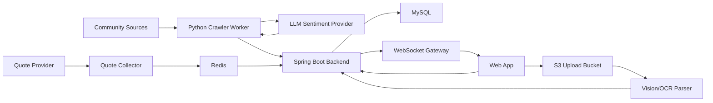

# 너나사 (YouBuyFirst) 최종 기획안

## 제품 한 줄 설명

너나사 (YouBuyFirst)는 커뮤니티 군중 심리, 시장 시세, AI 분석, 모의투자를 결합해 "대중보다 먼저 사고, 대중과 반대로 검증한다"는 아이디어를 실험하는 투자 참고형 시뮬레이터입니다.

## 제품 목표

차트와 재무제표만 보여주는 도구가 아니라, 사람들이 어디에 몰리고 무엇을 두려워하는지 수치화합니다. 사용자는 종목별 커뮤니티 심리, 가격 변화, 커뮤니티별 성과 검증, AI 에이전트의 모의 판단을 함께 보면서 투자 아이디어를 점검합니다.

이 제품은 실제 투자 자문이나 자동 주문 서비스가 아니라 B2C 모의투자와 교육형 분석 서비스로 설계합니다. 운영 단계에서도 "실거래 지시", "수익 보장", "개인화 투자 권유"처럼 법적 위험이 큰 표현과 기능은 배제합니다.

## 핵심 사용자

- 커뮤니티 분위기와 투자 심리를 빠르게 보고 싶은 개인 투자자
- 가격, 거래량, 커뮤니티 반응을 한 화면에서 보고 싶은 개인 투자자
- 투자 아이디어를 검증하고 싶은 초보 투자자
- AI 에이전트, 모의투자, 데이터 파이프라인을 포트폴리오로 보여주고 싶은 개발자
- 감성 데이터 기반 시장 지표에 관심 있는 퀀트/데이터 분석 학습자

## 최종 핵심 기능

### 1. 커뮤니티 감성 모멘텀

국내 주요 커뮤니티와 종목 토론방에서 신규 글을 30분 단위로 수집합니다. 게시글에서 국내 주식, 미국 주식, ETF 언급을 인식하고, 종목별 감성을 `bullish`, `bearish`, `neutral`로 분류합니다.

최종 지표는 단순 긍정/부정 비율이 아니라 언급량, 감성 강도, 증가율, 신뢰도, 소스 가중치를 함께 반영합니다.

주요 화면:

- 종목별 언급량 순위
- 열기 지수 순위
- 1시간/24시간 급등 종목
- 소스별 감성 분포
- 과열, 공포, 무관심 구간 표시

### 2. 시장 시세와 호가

투자 참고 사이트로서 감성 지표만으로는 부족하므로, 종목별 가격, 등락률, 거래량, 호가 또는 지연 시세를 감성 지표와 함께 보여줍니다.

최종 구조:

- 외부 quote provider adapter
- Redis latest quote cache
- Spring WebSocket/STOMP gateway
- UI price ticker
- API 장애 시 stale quote 표시와 fallback

운영 단계에서는 시세 제공자의 이용 조건을 확인합니다. 실시간 시세 재배포가 제한되는 경우 지연 시세, 사용자 개인 API 연결, 허용된 provider, 또는 모의 데이터로 대체합니다.

### 3. AI 3줄 요약과 이슈 설명

열기 지수가 급증한 종목에 대해 AI가 "왜 지금 언급량이 터졌는지"를 짧게 설명합니다. 원문을 그대로 노출하지 않고, 집계된 맥락과 제한 저장된 snippet을 기반으로 재서술합니다.

요약은 다음 정보를 포함합니다.

- 언급량 증가 원인
- 커뮤니티가 기대하거나 걱정하는 포인트
- 투자 판단이 아니라 관찰 가능한 심리 신호라는 고지

### 4. 커뮤니티별 수익률 비교 에이전트

커뮤니티별 심리 신호가 실제 가격 변화와 어떤 관계가 있었는지 검증합니다. 이 에이전트는 실거래 지시를 하지 않고, 각 커뮤니티를 하나의 가상 전략으로 보고 사후 수익률을 비교합니다.

초기 전략 후보:

- 에펨코리아 추종 전략: 일반 게시판에서 언급량과 긍정 감성이 함께 오른 종목을 가상 매수
- 디시 주식갤러리 역추종 전략: 과열 또는 극단 감성이 나온 종목을 반대로 해석
- 네이버 종토방 공포매수 전략: 종목별 게시판에서 부정 감성이 급증한 종목을 관찰
- 토스 종목 커뮤니티 보유자 심리 전략: 공개 운영 가능성이 검증된 범위에서만 반영

비교 지표:

- 신호 발생 후 1시간, 6시간, 24시간, 3일, 7일 수익률
- 추종 전략과 역추종 전략의 성과 차이
- 커뮤니티별 적중률, 평균 수익률, 최대 낙폭
- 시장 전체 상승장/하락장 대비 초과 성과

사용자 화면에서는 "어느 커뮤니티가 늘 맞는다"가 아니라 "최근 이 커뮤니티의 신호는 이런 성과를 보였다"는 실험 결과로 표현합니다.

### 5. 실시간 모의투자

사용자와 AI 에이전트가 동일한 가상 예수금으로 모의투자를 진행합니다. 주문은 실제 증권사 주문이 아니라 내부 체결 엔진에서 가상 체결됩니다.

주요 기능:

- 가상 예수금
- 시장가/지정가 모의 주문
- 보유 종목, 평가 손익, 실현 손익
- 거래 내역과 체결 로그
- 동시 클릭, 다중 기기 요청에 대한 잔고 원자성 보장
- 수익률 리더보드

### 6. AI 에이전트 배틀

서로 다른 투자 페르소나를 가진 AI 에이전트가 같은 시장 데이터와 커뮤니티 심리 데이터를 보고 매매 결정을 내립니다.

초기 에이전트 후보:

- 역발상 에이전트: 환희 구간에서 매도, 공포 구간에서 매수
- 모멘텀 에이전트: 언급량과 가격 추세가 동시에 상승할 때 추격
- 리스크 관리형 에이전트: 변동성과 손실 제한을 우선
- 관망형 에이전트: 확신이 낮으면 현금을 보유

에이전트는 내부 추론 전문을 노출하지 않고, 사용자에게 보여줄 짧은 결정 근거만 기록합니다.

### 7. 내 자산 OCR 연동

사용자가 타 증권사 앱의 잔고 화면을 캡처해 올리면, AI Vision이 종목명, 평단가, 보유수량을 추출해 가상 포트폴리오에 등록합니다.

최종 구조:

- 클라이언트가 S3 Presigned URL로 직접 업로드
- 서버는 업로드 권한과 분석 요청만 관리
- Vision API가 구조화 JSON을 생성
- 서버가 종목 마스터와 정합성을 검증한 뒤 저장
- 원본 이미지는 짧은 보관 기간 뒤 삭제

### 8. 알림과 자동화

후순위 기능으로 텔레그램 또는 앱 알림을 제공합니다. 알림은 투자 권유가 아니라 사용자가 설정한 조건 충족 안내로 제한합니다.

예시:

- 특정 종목 열기 지수 급등
- 공포/환희 구간 진입
- AI 에이전트 매매 발생
- 내 모의 포트폴리오 손익률 임계값 도달

## 커뮤니티 수집 전략

모든 커뮤니티를 같은 방식으로 수집하지 않습니다. 소스 구조를 먼저 나누고, 각 소스에 맞는 수집 방식을 적용합니다.

### 일반 게시판형

에펨코리아 주식 게시판, 디시인사이드 주식갤러리처럼 여러 종목 이야기가 한 게시판에 섞이는 구조입니다.

- 최근 글 목록을 주기적으로 수집합니다.
- 글 제목과 제한 snippet에서 종목명, 티커, 별칭을 인식합니다.
- 종목 언급이 없는 글은 저장하지 않거나 낮은 우선순위로 처리합니다.

### 종목 게시판형

네이버 종토방, 토스 종목 커뮤니티처럼 종목별로 방이 나뉘는 구조입니다.

- 모든 종목을 30분마다 전수 수집하지 않습니다.
- `CrawlTarget` 큐를 두고 종목별 수집 우선순위를 관리합니다.
- 우선순위는 시가총액, 거래대금, 전일 급등락, 일반 게시판 언급 증가, 사용자 관심 종목, 최근 활동량을 반영합니다.
- 활동이 적거나 실패가 반복되는 종목은 backoff로 수집 주기를 늦춥니다.

초기 MVP는 네이버 종토방과 에펨코리아에 집중하되, 종목 게시판형 설계를 먼저 열어둡니다.

## 공개 배포와 데이터 정책

30분 집계는 제품 핵심이므로 유지합니다. 다만 공개 배포 환경에서는 소스별 위험도와 활성화 상태를 분리합니다.

소스 상태:

- `enabled`: 운영 정책 검토 후 공개 환경에서 수집 가능
- `public-demo-only`: 공개 화면에는 fixture, 지연 데이터, 샘플 데이터만 사용
- `local-research-only`: 로컬 연구와 시연용으로만 실행
- `disabled`: 약관, 접근 제한, 안정성 문제로 비활성화

공개 화면 정책:

- 원문을 재게시하지 않습니다.
- 닉네임, 프로필, 작성자별 추적을 노출하지 않습니다.
- 작성자 표시명은 저장하더라도 hash로 제한합니다.
- 근거는 원문 복붙이 아니라 언급량 변화, 감성 비율, 대표 키워드, 링크 수, AI 재서술 요약으로 제공합니다.
- 제한 원문은 제목, 본문 일부, URL, 작성 시각, 작성자 표시명 hash, 원문 hash만 저장하고 30일 보관을 기본으로 합니다.
- 로그인 우회, CAPTCHA 우회, 프록시 회전, fingerprint 위장은 하지 않습니다.

수집 행위 자체가 약관, robots 정책, 데이터베이스 제작자 권리, 개인정보 이슈와 충돌할 수 있으므로, 관련 사례는 `docs/LEGAL_RISK_CASES.md`에 별도로 기록합니다.

## 최종 시스템 아키텍처

## 주요 데이터 도메인

- Instrument: 국내/미국 주식, ETF, 별칭
- CrawlTarget: 소스별/종목별 수집 대상과 우선순위
- CommunityPost: 제한 저장된 게시글 메타데이터와 snippet
- StockMention: 게시글 안에서 인식된 종목 언급
- SentimentAnalysis: 종목별 감성, confidence, 짧은 근거
- MetricSnapshot: 30분 단위 집계
- CommunitySignal: 커뮤니티별 종목 신호
- ForwardReturn: 신호 이후 가격 변화와 기간별 수익률
- CommunityPerformanceSnapshot: 커뮤니티별 추종/역추종 전략 성과
- QuoteSnapshot: 최신 시세와 호가
- UserPortfolio: 사용자 가상 포트폴리오
- SimulatedOrder: 모의 주문
- SimulatedExecution: 가상 체결
- AgentDecision: AI 에이전트의 행동과 사용자용 근거

## 보수적 개발 로드맵

### Phase 0. 작업 관리와 배포 기반

- GitHub remote 연결
- 한 작업 단위당 한 PR 규칙 정착
- GitHub Actions CI
- Docker Compose smoke test
- 문서 기반 인수인계 체계 유지
- Notion 작업일지와 트러블슈팅 기록 유지

### Phase 1. 데이터 파이프라인 MVP

- 네이버 종토방, 에펨코리아 수집
- 일반 게시판형과 종목 게시판형 수집 전략 분리
- 종목 마스터와 별칭 매칭
- LLM sentiment provider
- ingestion API와 admin API
- 30분 집계

### Phase 2. 감성/시세 대시보드

- 사용자용 ranking API
- 열기 지수 산식 확정
- 종목별 추세 조회
- 가격, 등락률, 거래량 표시
- 간단한 웹 대시보드
- AI 3줄 요약

### Phase 3. 커뮤니티 성과 검증

- CommunitySignal 도메인
- ForwardReturn 계산
- 커뮤니티별 추종/역추종 전략
- 커뮤니티별 수익률 비교 에이전트
- 시장 대비 성과 리포트

### Phase 4. 모의투자 엔진

- 가상 예수금과 포트폴리오
- 주문/체결 도메인
- 잔고 동시성 제어
- 거래 내역과 수익률 계산
- 리더보드

### Phase 5. AI 에이전트

- 에이전트 페르소나 정의
- 의사결정 입력 데이터 표준화
- 매매 결정 로그
- 에이전트별 성과 비교

### Phase 6. OCR 자산 연동

- S3 Presigned URL 업로드
- Vision parser
- 자산 등록 검증
- 이미지 보관/삭제 정책

### Phase 7. 운영 안정화

- 시세 API 이용 조건 점검
- 장애 격리, retry, backoff
- 인증, rate limit, 모니터링
- 공개 배포 소스별 활성화 정책 적용

## 명시적 제외 및 주의 사항

- 실제 투자 자문, 실거래 자동 주문, 수익 보장 표현은 하지 않습니다.
- 커뮤니티 로그인, CAPTCHA 회피, 프록시 우회, 지문 위장은 하지 않습니다.
- 원문 대량 저장과 외부 원문 재배포는 하지 않습니다.
- 작성자 개인별 성향 추적, 닉네임 랭킹, 개인 프로필 수집은 하지 않습니다.
- 내부 chain-of-thought는 저장하거나 노출하지 않고, 사용자용 짧은 근거만 저장합니다.

## 병렬 작업 트랙

최종 제품은 다섯 개의 작업 트랙으로 나눕니다. 각 트랙의 상세 경계는 `docs/workstreams/` 아래 문서를 기준으로 합니다.

- `community-data-platform`: 커뮤니티 수집, 소스 어댑터, 종목별 수집 타깃, 수집 정책
- `signal-intelligence`: 종목 인식, 감성 분석, 열기 지수, 커뮤니티별 수익률 비교
- `market-simulation-engine`: 시세/호가, Redis quote cache, 모의투자, AI 에이전트
- `frontend-experience`: 사용자 대시보드, UI 상태, mock data, API 연동, 차트
- `product-planning-ops`: 기획 조율, 작업 분리, 문서, Notion, PR/CI, 배포 정책
