# 너나사 부동산 ERD

이 문서는 현재 화면과 최종 기획을 기준으로 한 MySQL 기준 논리 ERD입니다.
핵심은 `지역/단지 target`을 중심에 두고, 사람들의 말, 시장 사실, 지도, 뉴스/링크, AI 근거 로그, 관심 지역을 연결하는 구조입니다.

## 설계 기준

- 부동산 정본 식별자는 지역/단지/생활권 target, 시장 사실, 반응 지표, 근거 로그 기준으로 관리합니다.
- 모든 화면은 `real_estate_targets`를 기준으로 지역, 단지, 생활권, 정책 영향권을 조회합니다.
- 커뮤니티 반응은 행동 지시가 아니라 관찰 지표입니다.
- 실거래, 전세, 매물, 정책, 지표 데이터는 `provider`, `asOf`, `stale`, `dataStatus`를 분리합니다. 실제 DDL은 MySQL 기준으로 `CHAR(36)`, `VARCHAR(255)`, `DATETIME`, `JSON`, `TINYINT(1)`을 사용합니다. Mermaid 화면 표기는 문법 호환을 위해 `CHAR36`=`CHAR(36)`, `VARCHAR255`=`VARCHAR(255)`, `DECIMAL12_4`=`DECIMAL(12,4)`, `TINYINT1`=`TINYINT(1)`처럼 줄여 씁니다. `PK,FK`는 부모 FK이면서 자식 테이블의 PK인 식별관계 컬럼입니다.
- 뉴스, 영상, 블로그, 커뮤니티 링크는 원문 재게시가 아니라 제목, snippet, URL, 출처 중심으로 저장합니다.
- AI 평가는 내부 추론 전문이 아니라 사용자용 요약, 근거, caveat만 저장합니다.

## 전체 ERD

로컬 공유용 화면은 `ERD.visual.html`입니다. 이 HTML은 관계선 ERD 위에 군집 배경과 한글 테이블명을 얹고, 별도 군집 보기에서 테이블 설명을 브라우저에서 직접 수정할 수 있게 합니다. 브라우저 수정값은 localStorage와 JSON 내보내기로만 보존되며, 정본 스키마는 이 문서와 `ERD.visual-import.sql`을 기준으로 합니다.

```mermaid
erDiagram
  APP_USERS {
    CHAR36 id PK
    VARCHAR255 email
    VARCHAR255 display_name
    VARCHAR255 password_hash
    VARCHAR255 auth_provider
    VARCHAR255 role
    VARCHAR255 status
    DATETIME created_at
    DATETIME last_seen_at
  }

  REAL_ESTATE_TARGETS {
    CHAR36 id PK
    VARCHAR255 target_type
    VARCHAR255 display_name
    VARCHAR255 slug
    VARCHAR255 normalized_name
    VARCHAR255 review_state
    VARCHAR255 data_status
    DATETIME created_at
    DATETIME updated_at
  }

  REAL_ESTATE_REGIONS {
    CHAR36 target_id PK,FK
    VARCHAR255 region_level
    CHAR36 parent_region_id FK
    VARCHAR255 legal_dong_code
    VARCHAR255 region_code
    VARCHAR255 geometry_id
    VARCHAR255 source
  }

  REAL_ESTATE_COMPLEXES {
    CHAR36 target_id PK,FK
    CHAR36 region_target_id FK
    VARCHAR255 address
    VARCHAR255 legal_dong_code
    INT built_year
    INT household_count
    DECIMAL12_4 latitude
    DECIMAL12_4 longitude
    JSON provider_keys
  }

  REAL_ESTATE_TARGET_EDGES {
    CHAR36 from_target_id PK,FK
    CHAR36 to_target_id PK,FK
    VARCHAR255 edge_type PK
    DECIMAL12_4 confidence
    VARCHAR255 source
    VARCHAR255 review_state
  }

  REAL_ESTATE_ALIASES {
    CHAR36 id PK
    CHAR36 target_id FK
    VARCHAR255 alias
    VARCHAR255 normalized_alias
    VARCHAR255 alias_type
    VARCHAR255 source
    VARCHAR255 evidence_url
    DECIMAL12_4 confidence
    VARCHAR255 review_state
    VARCHAR255 created_by
  }

  MAP_BOUNDARY_ASSETS {
    CHAR36 id PK
    VARCHAR255 asset_type
    VARCHAR255 source_label
    VARCHAR255 base_year
    VARCHAR255 asset_url
    DATETIME imported_at
  }

  MAP_FEATURES {
    CHAR36 id PK
    CHAR36 boundary_asset_id FK
    CHAR36 target_id FK
    VARCHAR255 geometry_id
    VARCHAR255 region_code
    VARCHAR255 parent_region_code
  }

  MAP_LAYER_SNAPSHOTS {
    CHAR36 id PK
    CHAR36 target_id FK
    VARCHAR255 layer_type
    VARCHAR255 period_key
    DECIMAL12_4 change_pct
    INT sample_count
    DECIMAL12_4 confidence
    DATETIME as_of
    VARCHAR255 data_status
  }

  CRAWL_SOURCES {
    VARCHAR255 id PK
    VARCHAR255 display_name
    VARCHAR255 source_type
    VARCHAR255 root_url
    VARCHAR255 access_mode
    VARCHAR255 status
    VARCHAR255 robots_status
    VARCHAR255 terms_status
    VARCHAR255 target_scope
    VARCHAR255 parser_status
    VARCHAR255 rate_limit_policy
    DATETIME last_reviewed_at
  }

  SOURCE_BOARDS {
    CHAR36 id PK
    VARCHAR255 source_id FK
    VARCHAR255 board_key
    VARCHAR255 board_name
    VARCHAR255 board_url
    VARCHAR255 status
    DATETIME last_crawled_at
  }

  COMMUNITY_POSTS {
    CHAR36 id PK
    VARCHAR255 source_id FK
    CHAR36 board_id FK
    VARCHAR255 external_id
    VARCHAR255 url
    VARCHAR255 title
    VARCHAR255 content_snippet
    DATETIME published_at
    VARCHAR255 time_confidence
    VARCHAR255 author_hash
    INT view_count
    INT recommend_count
    INT comment_count
    VARCHAR255 content_hash
    DATETIME ingested_at
  }

  CONTENT_ITEMS {
    CHAR36 id PK
    VARCHAR255 source_id FK
    VARCHAR255 content_type
    VARCHAR255 title
    VARCHAR255 snippet
    VARCHAR255 url
    VARCHAR255 domain
    DATETIME published_at
    VARCHAR255 metric_label
    VARCHAR255 status_label
    DATETIME ingested_at
  }

  CONTENT_TARGET_LINKS {
    CHAR36 content_item_id PK,FK
    CHAR36 target_id PK,FK
    VARCHAR255 link_type PK
    DECIMAL12_4 confidence
  }

  REAL_ESTATE_MENTIONS {
    CHAR36 id PK
    CHAR36 post_id FK
    CHAR36 target_id FK
    CHAR36 matched_alias_id FK
    VARCHAR255 matched_text
    VARCHAR255 match_source
    DECIMAL12_4 confidence
    VARCHAR255 review_state
  }

  ISSUE_TAXONOMY {
    VARCHAR255 id PK
    VARCHAR255 label
    VARCHAR255 group_name
    VARCHAR255 description
    TINYINT1 active
  }

  REACTION_ANALYSES {
    CHAR36 id PK
    CHAR36 mention_id FK
    VARCHAR255 reaction_direction
    VARCHAR255 issue_id FK
    DECIMAL12_4 confidence
    VARCHAR255 evidence_snippet
    VARCHAR255 model_version
    DATETIME analyzed_at
  }

  REACTION_SNAPSHOTS {
    CHAR36 id PK
    CHAR36 target_id FK
    DATETIME window_start
    DATETIME window_end
    INT mention_count
    DECIMAL12_4 expectation_score
    DECIMAL12_4 concern_score
    INT neutral_count
    VARCHAR255 overall_reaction
    INT source_count
    DECIMAL12_4 source_skew
    DECIMAL12_4 confidence
    VARCHAR255 coverage_status
    DATETIME as_of
  }

  REACTION_SNAPSHOT_ISSUES {
    CHAR36 snapshot_id PK,FK
    VARCHAR255 issue_id PK,FK
    DECIMAL12_4 share_pct
    VARCHAR255 direction PK
    VARCHAR255 summary
    DECIMAL12_4 confidence
  }

  REACTION_RANKING_SNAPSHOTS {
    CHAR36 id PK
    VARCHAR255 ranking_type
    VARCHAR255 window_key
    DATETIME window_start
    DATETIME window_end
    DATETIME as_of
    VARCHAR255 data_status
  }

  REACTION_RANKING_ROWS {
    CHAR36 id PK
    CHAR36 ranking_snapshot_id FK
    CHAR36 target_id FK
    INT rank_no
    INT mention_count
    DECIMAL12_4 mention_delta_pct
    DECIMAL12_4 heat_score
    VARCHAR255 headline_issue
    VARCHAR255 freshness_label
  }

  REAL_ESTATE_MARKET_FACTS {
    CHAR36 id PK
    CHAR36 target_id FK
    VARCHAR255 fact_type
    VARCHAR255 provider
    VARCHAR255 provider_dataset
    VARCHAR255 provider_object_id
    DATETIME observed_at
    DATETIME as_of
    DATETIME source_updated_at
    DATETIME ingested_at
    JSON value_json
    VARCHAR255 data_status
    TINYINT1 stale
  }

  MARKET_INDICATOR_DEFS {
    CHAR36 id PK
    VARCHAR255 category
    VARCHAR255 indicator_key
    VARCHAR255 display_name
    VARCHAR255 unit
    VARCHAR255 provider
    VARCHAR255 provider_dataset
    VARCHAR255 default_period
  }

  MARKET_INDICATOR_VALUES {
    CHAR36 id PK
    CHAR36 indicator_id FK
    CHAR36 target_id FK
    DATETIME period_start
    DATETIME period_end
    DECIMAL12_4 value_num
    VARCHAR255 value_text
    DECIMAL12_4 change_pct
    DATETIME as_of
    VARCHAR255 data_status
  }

  MARKET_DATA_SCHEDULES {
    CHAR36 id PK
    CHAR36 indicator_id FK
    VARCHAR255 schedule_label
    VARCHAR255 title
    DATETIME expected_at
    VARCHAR255 watch_note
    VARCHAR255 status
  }

  POLICY_EVENTS {
    CHAR36 id PK
    VARCHAR255 event_type
    VARCHAR255 title
    VARCHAR255 summary
    VARCHAR255 source_url
    DATETIME published_at
    DATETIME effective_from
    DATETIME effective_to
    VARCHAR255 target_scope
    VARCHAR255 data_status
  }

  POLICY_EVENT_TARGETS {
    CHAR36 policy_event_id PK,FK
    CHAR36 target_id PK,FK
    VARCHAR255 impact_type PK
    DECIMAL12_4 confidence
    VARCHAR255 review_state
  }

  TIMELINE_EVENTS {
    CHAR36 id PK
    CHAR36 target_id FK
    VARCHAR255 event_type
    VARCHAR255 source_ref_type
    CHAR36 source_ref_id
    VARCHAR255 title
    VARCHAR255 summary
    DATETIME occurred_at
    DATETIME as_of
    VARCHAR255 data_status
  }

  SIMILAR_WINDOW_MATCHES {
    CHAR36 source_snapshot_id PK,FK
    CHAR36 matched_snapshot_id PK,FK
    DECIMAL12_4 similarity_score
    VARCHAR255 match_reason
    JSON after_market_summary
    VARCHAR255 caveat
  }

  EVIDENCE_LOGS {
    CHAR36 id PK
    CHAR36 target_id FK
    CHAR36 snapshot_id FK
    VARCHAR255 evaluation_version
    VARCHAR255 tone
    VARCHAR255 summary
    VARCHAR255 subtitle
    JSON caveats_json
    VARCHAR255 data_quality
    DATETIME evaluated_at
    DATETIME as_of
  }

  EVIDENCE_LOG_ITEMS {
    CHAR36 id PK
    CHAR36 evidence_log_id FK
    VARCHAR255 evidence_type
    VARCHAR255 ref_type
    CHAR36 ref_id
    VARCHAR255 label
    VARCHAR255 value_text
    VARCHAR255 severity
  }

  USER_WATCH_TARGETS {
    CHAR36 user_id PK,FK
    CHAR36 target_id PK,FK
    VARCHAR255 watch_label
    VARCHAR255 status
    DATETIME created_at
  }

  ALERT_RULES {
    CHAR36 id PK
    CHAR36 user_id FK
    CHAR36 target_id FK
    VARCHAR255 rule_type
    JSON threshold_json
    TINYINT1 enabled
    DATETIME created_at
  }

  ALERT_EVENTS {
    CHAR36 id PK
    CHAR36 alert_rule_id FK
    CHAR36 target_id FK
    VARCHAR255 event_title
    VARCHAR255 event_summary
    DATETIME triggered_at
    VARCHAR255 status
  }

  OBSERVATION_LOGS {
    CHAR36 id PK
    CHAR36 user_id FK
    CHAR36 target_id FK
    VARCHAR255 log_type
    VARCHAR255 summary
    CHAR36 source_ref_id
    DATETIME created_at
  }

  APP_USERS ||--o{ USER_WATCH_TARGETS : saves
  APP_USERS ||--o{ ALERT_RULES : owns
  APP_USERS ||--o{ OBSERVATION_LOGS : writes

  REAL_ESTATE_TARGETS ||--|| REAL_ESTATE_REGIONS : region_profile
  REAL_ESTATE_TARGETS ||--|| REAL_ESTATE_COMPLEXES : complex_profile
  REAL_ESTATE_REGIONS ||--o{ REAL_ESTATE_REGIONS : parent_child
  REAL_ESTATE_REGIONS ||--o{ REAL_ESTATE_COMPLEXES : contains
  REAL_ESTATE_TARGETS ||--o{ REAL_ESTATE_TARGET_EDGES : from_target
  REAL_ESTATE_TARGETS ||--o{ REAL_ESTATE_TARGET_EDGES : to_target
  REAL_ESTATE_TARGETS ||--o{ REAL_ESTATE_ALIASES : has_alias

  MAP_BOUNDARY_ASSETS ||--o{ MAP_FEATURES : contains
  REAL_ESTATE_TARGETS ||--o{ MAP_FEATURES : mapped_to
  REAL_ESTATE_TARGETS ||--o{ MAP_LAYER_SNAPSHOTS : heat_values

  CRAWL_SOURCES ||--o{ SOURCE_BOARDS : has_board
  CRAWL_SOURCES ||--o{ COMMUNITY_POSTS : collects
  SOURCE_BOARDS ||--o{ COMMUNITY_POSTS : contains
  CRAWL_SOURCES ||--o{ CONTENT_ITEMS : publishes
  CONTENT_ITEMS ||--o{ CONTENT_TARGET_LINKS : links
  REAL_ESTATE_TARGETS ||--o{ CONTENT_TARGET_LINKS : mentioned_by_content

  COMMUNITY_POSTS ||--o{ REAL_ESTATE_MENTIONS : has_mention
  REAL_ESTATE_TARGETS ||--o{ REAL_ESTATE_MENTIONS : mentioned_target
  REAL_ESTATE_ALIASES ||--o{ REAL_ESTATE_MENTIONS : matched_by
  REAL_ESTATE_MENTIONS ||--o{ REACTION_ANALYSES : analyzed_as
  ISSUE_TAXONOMY ||--o{ REACTION_ANALYSES : classifies

  REAL_ESTATE_TARGETS ||--o{ REACTION_SNAPSHOTS : aggregated_for
  REACTION_SNAPSHOTS ||--o{ REACTION_SNAPSHOT_ISSUES : issue_mix
  ISSUE_TAXONOMY ||--o{ REACTION_SNAPSHOT_ISSUES : issue
  REACTION_RANKING_SNAPSHOTS ||--o{ REACTION_RANKING_ROWS : ranks
  REAL_ESTATE_TARGETS ||--o{ REACTION_RANKING_ROWS : ranked_target

  REAL_ESTATE_TARGETS ||--o{ REAL_ESTATE_MARKET_FACTS : has_fact
  MARKET_INDICATOR_DEFS ||--o{ MARKET_INDICATOR_VALUES : measured_as
  REAL_ESTATE_TARGETS ||--o{ MARKET_INDICATOR_VALUES : target_value
  MARKET_INDICATOR_DEFS ||--o{ MARKET_DATA_SCHEDULES : has_schedule

  POLICY_EVENTS ||--o{ POLICY_EVENT_TARGETS : impacts
  REAL_ESTATE_TARGETS ||--o{ POLICY_EVENT_TARGETS : impacted_target
  REAL_ESTATE_TARGETS ||--o{ TIMELINE_EVENTS : timeline

  REACTION_SNAPSHOTS ||--o{ SIMILAR_WINDOW_MATCHES : source_window
  REACTION_SNAPSHOTS ||--o{ SIMILAR_WINDOW_MATCHES : matched_window

  REAL_ESTATE_TARGETS ||--o{ EVIDENCE_LOGS : evaluated
  REACTION_SNAPSHOTS ||--o{ EVIDENCE_LOGS : uses_snapshot
  EVIDENCE_LOGS ||--o{ EVIDENCE_LOG_ITEMS : cites

  REAL_ESTATE_TARGETS ||--o{ USER_WATCH_TARGETS : watched
  REAL_ESTATE_TARGETS ||--o{ ALERT_RULES : alert_target
  ALERT_RULES ||--o{ ALERT_EVENTS : triggers
  REAL_ESTATE_TARGETS ||--o{ OBSERVATION_LOGS : observed
```

## 화면별 데이터 연결

| 화면 | 주요 엔티티 | 의미 |
| --- | --- | --- |
| `/dashboard` | `REACTION_RANKING_*`, `REACTION_SNAPSHOTS`, `MARKET_INDICATOR_VALUES`, `CONTENT_ITEMS`, `MAP_LAYER_SNAPSHOTS` | 요즘 언급 많은 지역/단지, 투기 과열 지표, 핵심 지역별 상승률, 뉴스/링크 요약 |
| `/realestate/map` | `MAP_BOUNDARY_ASSETS`, `MAP_FEATURES`, `MAP_LAYER_SNAPSHOTS`, `REAL_ESTATE_TARGETS` | 전국 시도 heat layer와 기간별 상승/하락 색상 |
| `/realestate/map/:regionId` | `MAP_FEATURES`, `REAL_ESTATE_REGIONS`, `REACTION_SNAPSHOTS`, `REAL_ESTATE_MARKET_FACTS`, `TIMELINE_EVENTS` | 시군구 drilldown 지도와 선택 지역 리포트 |
| `/realestate/reactions` | `REACTION_RANKING_*`, `REACTION_SNAPSHOTS`, `REACTION_SNAPSHOT_ISSUES`, `EVIDENCE_LOGS` | 지역/단지 순위, 급증 신호, 근거 로그 |
| `/realestate/targets/:targetId` | `REAL_ESTATE_TARGETS`, `REAL_ESTATE_ALIASES`, `REACTION_SNAPSHOTS`, `REAL_ESTATE_MARKET_FACTS`, `TIMELINE_EVENTS`, `SIMILAR_WINDOW_MATCHES`, `EVIDENCE_LOGS` | 지역/단지 상세 리포트. 실제 정본 키는 `target_id`/`slug`로 매핑합니다. |
| `/indicators` | `MARKET_INDICATOR_DEFS`, `MARKET_INDICATOR_VALUES`, `MARKET_DATA_SCHEDULES`, `REACTION_SNAPSHOTS` | 가격·거래량, 공급·수급, 수요·심리, 거시·금융 지표 |
| `/newsroom` | `CONTENT_ITEMS`, `CONTENT_TARGET_LINKS`, `CRAWL_SOURCES` | 뉴스, 리포트, 영상, 블로그/커뮤니티 링크 모음 |
| `/realestate/watchlist` | `APP_USERS`, `USER_WATCH_TARGETS`, `ALERT_RULES`, `ALERT_EVENTS`, `OBSERVATION_LOGS` | 관심 지역/단지, 알림 조건, 관찰 로그 |

## 구현 순서 제안

1. `REAL_ESTATE_TARGETS`, `REAL_ESTATE_REGIONS`, `REAL_ESTATE_COMPLEXES`, `REAL_ESTATE_ALIASES`
2. `CRAWL_SOURCES`, `SOURCE_BOARDS`, `COMMUNITY_POSTS`, `REAL_ESTATE_MENTIONS`
3. `REACTION_ANALYSES`, `REACTION_SNAPSHOTS`, `REACTION_SNAPSHOT_ISSUES`
4. `REAL_ESTATE_MARKET_FACTS`, `MARKET_INDICATOR_DEFS`, `MARKET_INDICATOR_VALUES`
5. `MAP_BOUNDARY_ASSETS`, `MAP_FEATURES`, `MAP_LAYER_SNAPSHOTS`
6. `TIMELINE_EVENTS`, `SIMILAR_WINDOW_MATCHES`, `EVIDENCE_LOGS`
7. `APP_USERS`, `USER_WATCH_TARGETS`, `ALERT_RULES`, `OBSERVATION_LOGS`

초기 MVP에서는 `APP_USERS` 없이 mock 관심 지역을 둘 수 있지만, 실제 서비스 저장으로 넘어가면 관심 지역과 알림 조건은 사용자별 테이블로 분리해야 합니다.

## 설계 메모

- `REAL_ESTATE_TARGETS`는 region, complex, living_area, policy_area의 상위 식별자입니다. 이렇게 두면 지도, 반응, 뉴스, 지표, 관심 지역이 모두 같은 `target_id`로 연결됩니다.
- `REAL_ESTATE_REGIONS.target_id`, `REAL_ESTATE_COMPLEXES.target_id`는 `REAL_ESTATE_TARGETS.id`를 그대로 PK로 쓰는 식별관계입니다. 지역/단지 profile은 target 없이는 존재하지 않습니다.
- `REAL_ESTATE_TARGET_EDGES`는 행정구역 포함 관계뿐 아니라 생활권, 학군, 교통 영향권, 정책 영향권을 표현합니다.
- `REAL_ESTATE_TARGET_EDGES`, `CONTENT_TARGET_LINKS`, `REACTION_SNAPSHOT_ISSUES`, `POLICY_EVENT_TARGETS`, `SIMILAR_WINDOW_MATCHES`, `USER_WATCH_TARGETS`는 순수 연결 테이블이라 surrogate `id`를 두지 않고 관계를 이루는 컬럼들을 복합 PK로 둡니다.
- `REACTION_RANKING_*`는 `REACTION_SNAPSHOTS`에서 만들 수 있는 materialized snapshot입니다. 대시보드와 지역 반응 화면을 빠르게 보여주기 위한 캐시 성격입니다.
- `TIMELINE_EVENTS`는 원천 테이블을 복사하는 정본이 아니라 상세 화면에서 반응, 시장 사실, 정책, 뉴스 흐름을 시간순으로 묶기 위한 view/cache 성격입니다.
- `EVIDENCE_LOG_ITEMS.ref_type/ref_id`는 여러 근거 테이블을 가리키는 논리 참조입니다. 실제 RDB 구현에서는 근거 타입별 join table로 나누거나 application-level integrity를 걸 수 있습니다.
- `CONTENT_ITEMS`는 뉴스룸과 대시보드 외부 링크용입니다. 크롤링된 커뮤니티 원문 분석은 `COMMUNITY_POSTS`와 `REAL_ESTATE_MENTIONS`가 담당합니다.
