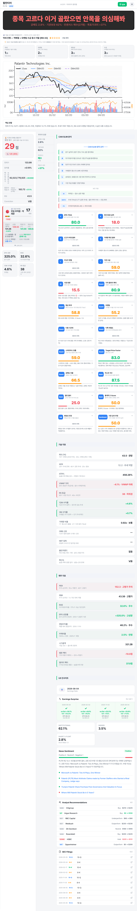
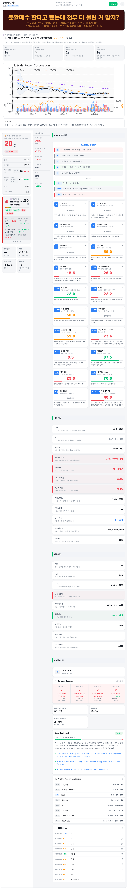
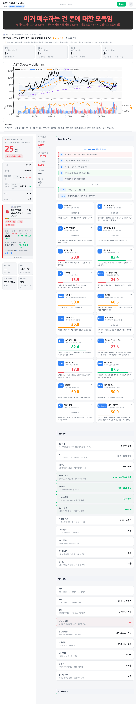

# Stock Detail Banner

> Legacy stock reference: 이 문서는 기존 주식 화면 참고용입니다. 부동산 평가 문구 기준은 `docs/domains/agent/REAL_ESTATE_EVALUATION_COPY.md`, 새 상세 화면 기준은 `docs/layers/ui/screens/realestate-target-detail.md`입니다.

## 역할

종목 상세 상단의 검은 팩트폭격 배너 표현 기준입니다. 이 문서는 legacy reference이며 새 부동산 화면 정본으로 사용하지 않습니다.

## 시각 레퍼런스

사용자가 준 레퍼런스는 종목 상세 최상단의 검은 네모 배너입니다. 프론트에서는 이 영역을 일반 카드가 아니라 `stock-roast-banner` 같은 독립 상단 훅으로 다룹니다.

  
  
  

## 배너 구조

- 화면 상단, 종목 이름 아래 또는 바로 다음 영역에 배치합니다.
- 배경은 검정 또는 매우 어두운 회색, 카드 반경은 작게 둡니다.
- 헤드라인은 붉은색/주황색 계열로 크게 중앙 정렬합니다.
- 보조 문장은 헤드라인 아래에 작게 두고, 근거 지표를 `·`로 짧게 연결합니다.
- 배너 아래에는 종목 메타, 핵심 요약 카드, 차트가 이어집니다.
- 모바일에서는 헤드라인이 두 줄까지 허용되며, 세 줄 이상이면 문구를 줄입니다.

## UI 계약

| 필드 | UI 처리 |
| --- | --- |
| `headlineTone` | tone별 색과 강도를 바꿉니다. |
| `headline` | 상단 큰 한줄평입니다. |
| `subtitle` | 근거 지표 3-5개를 작은 보조 문장으로 노출합니다. |
| `evidence` | 펼침 또는 tooltip 후보입니다. |
| `asOf` | 기준 시각을 작게 표시합니다. |
| `dataQuality` | stale, partial, mock, insufficient 상태를 배지로 표시합니다. |
| `personalizedSafe` | false면 개인화/보유 종목 화면에서 순화 문구를 씁니다. |
| `disclaimer` | 투자 자문이 아니라 상태 요약이라는 고지를 연결합니다. |

## 참조

- 생성 기준: legacy stock reference. 새 부동산 평가 카피 정본은 `docs/domains/agent/REAL_ESTATE_EVALUATION_COPY.md`
- 화면 상세: `docs/layers/ui/screens/stock-detail/README.md`
- 디자인 시스템: `docs/layers/ui/DESIGN_SYSTEM.md`
